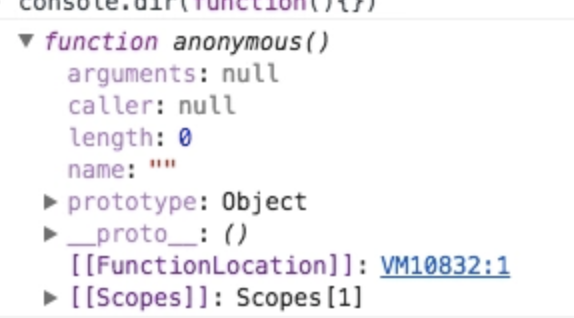

### 第一篇文章

> 从开始学前端直至现在已有一年的时间了，期间遇见了很多事情，也经历了各式各样的技术问题，为了让自己摆脱这些这些问题，最后养成了看书的习惯。因为每次看完总觉得自己内功又增了，哪怕只是一点。可惜的是每次看完都会忘掉一些，尤其是没有自己的实践和知识点太多时总会遗忘一些，但我不希望这种事情发生，
可能只是因为这一点，以后就会找几天的bug，这是每个程序员都不敢预想的场景。最后我决定把我每天对知识的累积，用我理解的角度去记录下来。笔记和文章唯一的不同前者是私有，后者是公开的，希望通过我对它理解可以帮助他人，也请大家能指出文章中的问题，感激不尽。


1. ## 类型

ECMAScript语言中所有的值都对应一个类型。语言类型包括：Undefined，Null，Boolean，String，Number，Object。对于语言引擎和开发人员来说，类型是值的内部特征，它定义了值的行为，是所有编程语言的共有的概念，并使其区别于其他值。
抛开学术界对类型定义的分歧，为什么说JavaScript是否有类型也很重要呢？让我们来详细介绍一下，关于JavaScript类型这部分的知识。


### 内置类型

> 首先JavaScript有七种内置类型:

 - `空值(Null)`
 - `未赋值(Undefined)`
 - `字符串(String)`
 - `数字(Number)`
 - `对象(Object)`
 - `布尔值(Boolean)`
 - `符号(Symbol ES6中新增)`

注: 除对象以外其他统称为`基本类型`.

下面我们用typeof查看这七种类型值，但是结果却和它们的类型名称不尽相同。
```javascript
        typeof {community:"sf"} // "Object"
        typeof undefined        // "undefined"
        typeof 12               // "number"
        typeof "javascript"     // "string"
        typeof true             // "boolean"
        typeof Symbol           // "symbol"
```

上面的这六种类型都和我typeof出来的字符串互相对应。

咦? null 哪去了？现在我门来单独看案它的类型.
```javascript
typeof null === "object"     //true
```
你可能会看到null并不是"null"，这是JavaScript一个历史悠久的bug，但是由于web系统对其的依赖，很难修复，这个bug也许会一直存在雨javascript中。我们需要铭记在心，避免以后程序出现问题。我们再用复合条件来检测一下null值的类型：

```javascript
     var a = null;
     (!a && typeof a === "object" )  // true
```

 由此我们知道，null隐式强制类型转换成了反值为true(说明null的布尔值为false)，并对它的类型做出全等比较，最后返回true。


```javascript
typeof function(){}  // "function"
```

这样看来，function也是JavaScript的一个内置类型吧？可以去查阅一下[ECMAScript规范][1]，它其实是`Object`类型中的`子类型`，也就是说它属于Object类型范畴之内，具体来说，函数是`可调用对象`，它有一个内部属性[[call]]使其可以被调用。
   那么它有什么对象的特征呢？让我们来在控制台中打印出来看一下.
   


可以看到，函数当中有一些可读取属性，就比如 .length属性，代表的是其声明的参数个数，

```javascript
var fun = function(a,b){}
fun.length //2
```
查看了function，让我们再来查看一下Array类型.
```javascript
typeof [1,2,3] === "object"  //true
```
它们都同属于`Object子类型`， 数组的元素按数字顺序来进行索引(非字符串那样通过字符串键值)，其`length`属性是其数组元素个数。

----------


### 值和类型
JavaScript中的类型是`相对于他的值`来定义的，也就是说衡量类型的永远都是值本身，与变量无关，变量只是储存值的一个容器，在这个容器中有`不确定的值类型`

JavaScript 不做`类型强制`，也就是说，语言引擎不要求变量总是与`初始化值同类型`的值。

```javascript
   var a = 10;
   typeof a    // "number"

   a = true;
   typeof a    //"boolean"
```
   typeof 总会返回一个字符串

```javascript
  typeof typeof 10     //string  
```
  typeof 10 返回为 "number"  之后再次使用typeof "number"  结果为 `”string“`


----------


### Undeclared与Undefined

我们都知道undefined代表`未被复制`，它也是我们七大类型中的一种，如下:

```javascript
     var a;
     typeof a      //"undefined"
     
     var b = 20;
     var c;
     
     b = c;
     typeof b      // "undefined"
     typeof c      // "undefined"
```


可能有些朋友对Undeclared有些陌生，让我们来看一下它与Undefined的定义:
`在作用域中未被声明过`的变量为 Undeclared。
作用域中声明了且未被赋值的为`Undefined`。

遗憾的是我们在js环境下测试时，两种情况却并没有出现Undeclared，这是为什么呢？

```javascript
   var a ;
       
   a;     //undefined
   b;     //ReferenceError : b is not defined
```
"b is not defined " 容易让人误解为与undefined的性质一样，其它们两个是`两码事`此时浏览器如果报成 `b is not found` 或者 `b is not declared`会更加准确。

虽然JS当中没有Undeclared的`显式概念`,但是我们要知道它是存在的，Undefined 与 Undeclared 是完全两种不同的`场景`;

```javascript
  var a ;
  typeof  a //undefined
  typeof  b //undefined
```
对于Undeclared照样返回了undefined。这里b虽然是一个Undeclared变量，但typeof b 它并没有报错，这是因为typeof有一套安全防范机制。


----------


### typeof Undeclared
该安全机制在浏览器运行时的JavaScript代码来说是很有帮助的，因为多个脚本文件会在共享的全局命名空间中加载变量。

举个例子 ，如果我们在布尔环境下为一个值做非空判断。
```javascript
   if(DETELE){}  // ReferenceError: detele is not defined
```
抛出了错误，上面已经解释过，此处不再强调它的准确意义。为了避免程序出现这种促五，我们可以使用 typeof 来对它进行改造。

```javascript
  if(typeof DETELE === "undefined"){  }
```

同样属于非空条件判断，后者的优势，我想大家已经看到了，不论何时它都不会报错，只是淡出的`返回布尔值`。

可以看到 typeof 的安全防范机制为我们提供了非常便捷的方式，还有一种方式如下:

```javascript
   if(window.DETELE){}
```
    
如果这个变量存在于全局中，我们可以利用它，全局变量中默认为全局属性的特性，来通过查找对象属性的方式去查看它，当然这只是在全局条件下，当非全局条件下，我们可以继续使用typeof去判断。
