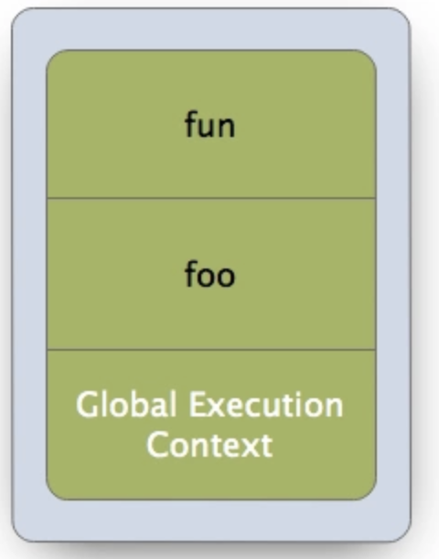
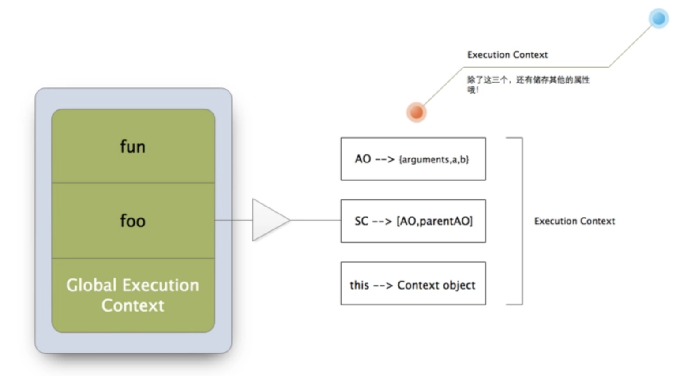

> javascript 当中的 `this`是一个用于指向当前`上下文对象`的关键字。在面向对象编程及日常开发当中我们经常与其打交道，初学javscript的朋友非常容易误入歧途从而理解错误。

##上下文对象概念
   在我的[深入贯彻闭包思想][1]一章中其实已经讲了很多关于环境栈(即上下文对象)的相关内容，但内容过于冗长，不便阅读，时间充足的同学可以去看下，但这篇中，我们还是独立开来，下面我总结了几条有关上下文的知识，希望能帮助大家。
 
首先需要声明的是这些术语的问题，其实我们常说的**环境栈**，**调用栈**，**上下文栈** 等等很多民间自创术语，它们形容的都是一个东东，即`环境栈`(这里我就拿第一个词来形容了，大家知道就好)
    
### 执行上下文栈 (Execution context stack, ECS)
javascript代码块有三种运行环境分别是：

**1.全局(Global code)**

默认执行环境,也就是没有任何函数包裹在window下执行的代码片段。
```javascript
 //window
 var a = 12;

 (function(){
    a = 13;
 }())
```
就比如这两段代码前者在全局window下执行了一个新建变量与赋值的操作。后者是一个匿名自调函数，**它的上下文一定是Global**，所以，无论在哪里运行它，**它只能访问自身的活动对象以及Global的变量对象**。

**2.函数(Function code)**

```javascript
 function fun(){
   a = 24;
   return a;
 }

 var foo = new Function("var a = 12; return a;");

 foo();
 fun();
```


<br/>
除外的Function它表示在函数当中执行的代码

**3.eval (Eval code)**

以上两种情况指的是在特定情境下的代码片段，但是不包括另一种情况，也就是eval环境 (这里应指动态环境，因为据我所知以目前JS版本,只有eval可以创建动态执行环境吧? )。

```javascript
  var codeStr = "var a = 12";
  eval(codeStr);
```

----------

以上三种执行上下文构成了执行上下文栈(ECS),在整个栈中有依次排列的上下文(Execution Context),位于最底层的是Global全局环境，上面依次是函数执行环境。而eval则会在运行中javascript引擎临时去创建，也就是没有在预编译前几毫秒进行编译代码整合。

  
  <br />
  在每个EC当中存有几个特别重要的属性，**变量对象**,**作用域链**,**this指向**

 - 变量对象(Variable Object,VO)
     - 变量
     - 函数的声明
     - 函数的参数


 - 作用域链(Scope Chain)
构成作用域的开山鼻祖? (确切的说应该是词法作用域,但不能排除eval创建的动态环境)

 - this 指向
没错，它储存一个`对象的引用地址`，但不是在词法阶段定义的，而是在运行时绑定的，`它引用的值取决于函数调用时的各种条件`。只取决于函数的调用方式。

变量对象里面存储了在上下文中定义的变量和函数声明。在函数上下文环境下不能直接使用变量对象，而是要等到`执行流`进入当前环境下来激活，被称作**活动对象**

注:上面说了在一个EC中它们是属于特别重要的属性(其构成了最基本的作用域规则)，也就是说还有其他javascript内部实现需要的属性,它们大概包含函数的调用方式，在哪里被调用等等.

好了整理一下，`在这一小节里面，我们大致了解了ECS及EC的概念以及this与他们的关系及其this的定义.

## 使用 this

```javascript
 // Global Context
 var obj = {
   fun:()=>()=>{ console.log(this); },
   foo:()=>{ console.log(this); }
 }
 
 obj.foo.name = "tongtong";

 /*
    把foo函数转赋给context变量，这时foo函数对象身上的属性是具备`复合类型条件`的，即引用.
 */

 var context = obj.foo;

 //通过返回的函数来二次调用，同样属于全局环境下，因为内部函数调用时已经不属于obj对象了.
 obj.fun()();  //window
 
 context();  //window
 context.name; // "tongtong"

```
函数不是简单类型值,是`复合类型`，我们一样可以用`.`操作符像对待对象一样为它添加属性与方法。与其他**两位小伙伴**(Array Object)不同的是，它可以调用呀。只要调用环境变化了，this当然也就随波逐流。

以上这个例子，我们需要注意，在把它们赋给其他变量时，由于**它的执行环境是会变化的**，即每次调用都会`刷新this`，对于新手来说，这点一定要搞清楚。


```javascript
//global Context

//no.1
(function(){ console.log(this); }()) //window

//no.2
var x = 12;
var foo = function(){
    this.x = 12;
}

new foo();

x //12
```

 - 在闭包中this是指向window的. 如若不然呢？它没有任何调用者，它是自调，只能是window，也可以这样理解 : **所有以函数调用的方式this一定是window**，即`foo()`。而 `obj.foo(); new foo()`它们的this是有意义的。


 - 创建实例时的构造函数中的this，永远指向那个实例后对象，不是`外部环境`. 使用new来调用函数时，先改变其上下文环境，在对其构造函数进行调用。对顺序不清楚的同学，请自行查阅关于 javascript生成实例步骤.


## call 与 apply
这两个方法位于Function.prototype，拥有更改上下文的功能，前者需手动填写函数参数，后者可以通过数组来表示。

```javascript
 // Global Context
 
 var obj = {};

 //call
 var foo = function(num){ 
    console.log(this);
    console.log(num + 8);
 };

 foo.call(12); // obj 20
 foo(12);  //window 12

 //apply
 var fun = function(){     
    console.log(this);
 console.log(Object.prototype.slice.call(arguments).redux((x,y)=> x + y); ) 
 }

 fun.call(obj,[12,34,56,78]);
 fun(null,[12,34,56,78]);
 
```
他们都把第一个参数作为`上下文`并调用。那么如何更改一个函数的上下文调用环境呢？我们以bind来简单模拟一下。

```javascript
var _bind = function(fun,context){
    
    //取第一个之后的参数列表.
    var params = [].slice.call(arguments).slice(2);
 
    //给我们的函数指定上下文对象。
    context.fun = fun;
    
    return function(){ var result = params.concat(Array.from(arguments)); return context.fun(result)};
}
```

至于call,apply方法的模拟实现，这里就不说了，感兴趣的童鞋可以去网上搜索一下.

##常见面试题

```javascript
var a = “111”;
var b = “222”;
function test() { 

　　var a = “333”;
　　var b = “444”; 
　　alert(this.a);
　　alert(this.b); 

}
var test= new test() ;
alert(test.a);
alert(test.b); 
```
在创建一个实例时，它的`类`内部的this必然是这个实例。他的顺序大致是 

 1. 创建上下文环境
 2. 执行构造函数
 3. 把构造函数的prototype，放到实例的原型上

这里我们只需要知道它先创建上下文，再进行调用构造函数.


----------


```javascript
var obj = {
    Pagination:function(){ return this; }
};

new obj.Pagination(); // Pagination {}

```
查找this的机制与作用域一致，都是就近原则。


----------


```javascript
setTimeout(function(){ return this; },0);  //window
```
setTimeout回调的执行环境下的this对象是window，几乎浏览器的所有原生方法回调函数的this都是window，但是如果我们在其场景使用回调，这个this就变成不可`预期`的了，因为我们不知道此函数，到底在哪里执行了.


##忆之获
  
 - this是执行时决定的，也可以说函数调用时，决定的。
 - EC中附带的三类对象(非全部),其中this作为其中一员，每次执行流进入EC时，它都有可能会更新。而this的改变正是依赖这种现象。
 - this使用就近原则，从当前环境向外延伸，直至找到`离它最近`的那个对象为止。
 - 列表项目

##题外话
   我特别希望大家能在文章中给我提出意见，文中内容都是博主个人理解，算不上是对的，所以我建议大家只做参考，或看其他类似文章做一个自己的总结，每个人理解javascript都不一样，如果不看底层编译原理，在这个层面之上，我们只能靠这种方法理解了。。。但是记住，凡事都要自己求证的，别人说的是他人的观点，自己理解出来的才是最适合你的.
