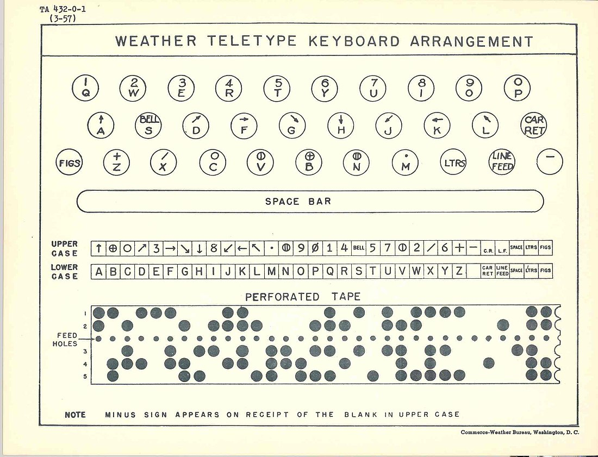
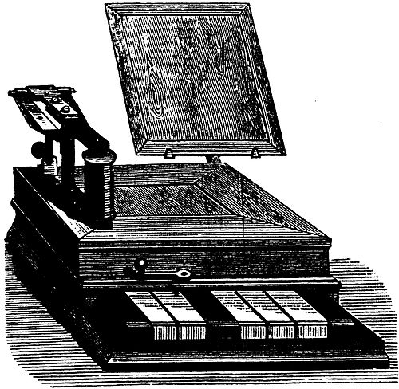

> 这段时间，在github上贡献了一个读取媒体头文件的JS项目，此作者的repos中有很多关于字符编码的库，而且作者很给力，有任何不
懂的问题和想要了解的东西可以给他发issue，热爱讨论，然后我以一个学习者的身份，把关于编码的一些repo fork了下来，顺便和最近正
在读的《隐匿在计算机后的编码》串起来总结一下。

<br />

## 计算机的基础编码结构

<br />

### 集成电路-数据的最小单元

---
计算机说白了就是一个`集成电路(integrated circuit)`，电路可以形成逻辑，`逻辑`作为形式上的计算机最小运算单元，我们通常把它称作为布尔值。布尔值慕名思意来源于布尔代数，它是数学家布尔发明了用数学表达逻辑的运算方式😂，
发明了很多年之后，布尔代数才与电路相互结合，然后出现我们现在比较熟悉的`逻辑门`，`触发器`，`晶体管`, `加法器`, `继电器`。
其实继电器是比计算机出现的早得多，早在电报时期它就被发明出来，主要的目的是`刷新`电压提高电流以传输得更远，
但是后来继电器不仅仅是`继电`那么简单，玩法开始越来越多，这个后期会提一下。
以上只是随便说了点历史和硬件，这里只需了解电路和二进制和逻辑的关系，逻辑最小可解构为两个部分，分别为1,0，也就是是或者否，二进制表示为0或者1，
它们完全符合电路的打开和闭合的规则。所以任何事情在计算机中，都无非是电路的闭合或开关组成的。

### 二进制(Binary)
通过上面，我们知道二进制只是符合计算机运算规律的进制数，
就好比我们人类擅长使用10进制来计算一样，我们在代码中一般都会使用10进制数字进行运行，甚至是8进制，16进制等等各类表示方法，
总之怎么方便计算，方便表示，我们就用几进制，但是总归该是要转换成2进制给计算机的，这也就是我们编译器做的事情，对于运行时语言，
则又多了一层`宿主语言`也就是母语言，就比如c++于js。

## 莫尔斯电码(Morse code)

Morse电码是`莫尔斯`于`1837`年(电子计算机未出现，还处于电报时期)发明的, 它是早期的数字化通信的一种形式，使用电流的`闭合`,`断开`,`长短`的方式帮助人们走上了**电子**通讯时代。

它有四种信号，分别是，`短信号`，`长信号`, `短停顿`, `长停顿`，基于这四种状态，可以扩展很多`表现形式`，比如，`字形`(盲人也可以用)，
`灯光`(军队使用手电筒交换暗号)，`声音`(最原始的使用方式，比如电报机)。所以，它可以让人们从听觉，视觉，触觉上非常方便的传递信息。

<p class="text-center">
  
</p>

上图是图形化的莫尔斯码编码集，它的外形很好辨认，比如现在我们如果发一个求救信号(国际求救信号为：`SOS`), 
就可以把`Morse电码`带入，书写方式为 `...---...`, 三点表示S，三个破折号表示O，合起来就是SOS。

如果声音表示的话，就是三短三长三短, 电流声大概是，`哒哒哒 | 嘀嘀嘀 | 哒哒哒`。灯光的话也是如此，如手电，三短三长三短(开关灯)。
每个字符之间的信号是短停顿，如果过了一个字符就是长停顿，以上的哒哒和嘀嘀每个字之间的停顿就属于短停顿，但每组之间属于长停顿。

所以这也就是为什么抗日剧里的电报员为什么戴个耳机🎧，拿个笔头✏️在那点点，点完之后还得译码(**早期的中国电报系统不使用Morse电码集，是有自己的编码集，
但是还是这四个信号的基础形式是不变的**)。

从此，基于电流传输信息的电子时代来临，注：如果想使用莫尔斯编码的可以在[这个](https://morsecode.world/international/translator.html)地址上试试。

## 博多电码(Baudot code)

莫尔斯电码虽然有4个状态，但我们基础操作就只需要**一个键来开启和闭合电流就可以发送一段段电码**，这也是它不易使用的一个主要原因。
因为`输入键`太少，增加了译码和编码的难度。`博多电码`正是弥补了这一缺陷，把它扩充到了个5个键，那么这样一来，就有32个状态了(5的二次方)。

但对于26个英文字母和0-9数字还有一些常用符号来说，其数量远远大于32个状态，这种情况`博多`并没有增加bit位，而是把它们分成了两个`字符集`，
在每个字符集中增加一个`符号`(注意这里是符号，而不是bit，因为那个年代还没有出现电子计算机，纯机械式的计算工程增加一个bit是很复杂的)来切换两种模式，
就好比我们现在的切换大小写模式一样。



如上图，虽然是32个按钮，实际上我们可以通过`切换符号`(位于键盘上的一个按钮)来表示`64`(32*2)个符号，基本上能覆盖常用字母数字和符号，
但还不能全部包括大小写字母。

基于`机械式的电报机`来传输信息对于人们来说过于繁琐，因为需要在线发送和接受，不能作为离线的数据段存储起来，并且在发送端，
它只是`纯按钮`，并不是人们可识别的字体，如下图。

<p class="text-center">
  
</p>

所以`1899`年，美国人`Donald Murray`的`电传打字机(teleprinter)`诞生，什么是电传打字机呢？


初期的电传打字机也广泛应用`博多电码`，眼尖的同学也可以看到图的左边会有`穿孔纸带`(一个数据存储方式，后来被磁带和硬盘替代)，这键盘上有A-Z字母和数字还有常用符号，
然后接收端可以自动打印`穿孔纸带`，这要比`博多电报机`在输入上更为方便。

## Ascii 编码

时间来到了`1963`年，ASCII诞生，并发布了它的第一个版本，最初的设计也是为了强化`电传打字机`。（ASCII这里之所以叫编码而不叫电码，是因为在它诞生的年代已经完全抛弃了电报机，逐渐走向电子计算机的时代，这意味着，它可以嵌入计算机系统中，
通过网络传输）

它支持大小写字母和更多的标点符号，还有为了应用在更多的设备上而生的`控制字符`(无字形)，起初范围只有0-127(7bit, 不到一个字节)，也就是128个字符，
前32个字符是为了在早期表示一些元信息，并无实际字形，比如在打印机上，码点10代表需要换行，然后打印机会把打印纸向上抽一点，
碰到码点2时，就说明是开头，那么就会从头开始印。

真正的有字形的码点是从 32 开始到 126 的(因为127是`删除字符`, 也是无字形的), 我们可以通过javascript打印看一下这些有字形的字符。

```javascript
for (let i=32; i<=126; i++) {
     console.log("有字形", String.fromCodePoint(i))
}
for (let i=0; i<=31; i++) {
     console.log("无字形", String.fromCodePoint(i))
}
console.log("无字形", String.fromCodePoint(127))
```

打印出来的有字形字符包含0-9,a-z,A-Z,和一些常用的字符，作为使用英文的国家，这些字符能够满足日常沟通的需求，
但有一些专业的学科论文会包含一些数学字符和音乐符号，这在当时的应用中也是无法满足的。(就比如数学计算中除号之前是一个横线上下两个点，
但在电子设备中中用/符号表示，这就是早期为了节省符号而做出的重用选择)

后来ASCII被广泛应用后，发现它表示英语还行，但是其他语言的字符就没啥用了，这时为了兼容其他语言，ASCII还尝试利用剩下的一个bit去表达更多的字符，
即2的8次方被扩充到了256个字符，但即使这样，对于法语等西方语言来说是有可行性的，因为他们都是基于拉丁字母的语言，差异只是在个别的扩充字符上，所以多出来的
这一个比特位可以兼容，但是亚洲区语言就不行了，光汉语就好几万个字符，之后万国码(Unicode)出现。

## Unicode 字符集

--- 

好了，重头戏来了，上面介绍了19世纪和20世纪早期的编码历程，可以发现不管是莫尔斯，博多，还是ASCII，他们都是为了让人类文字信息能够在`电子`设备中传输，
存储，所做的`编码`手段。Unicode也是为了更好的解决这个问题，但有了ASCII的前车之鉴，它并没有插手`编码`部分。

为什么这么说呢，大家想一下，ASCII没有被广泛流行起来的主要原因其实是它不能根据不同的语言区域划分不同的编码方式。也就是说，ASCII其实是字符集+编码的组合体。
但Unicode玩的就是字符集，没有编码，编码交给上层去做，上层想要兼容哪个语言，你自己去选编码方法，我这里只给你们**字符集**(可以简单理解成一个`映射表`)。

自11.0版本以来，Unicode已经支持了十三万多个字符，也包含了很多小语种，几乎大多数的语言全都覆盖了。

在电脑系统中设置字符集为Unicode时(在windows中，可以通过`chcp`命令来查看当前所使用的字符集，详情查看[这里]( https://www.cnblogs.com/xpws/p/3625177.html))，
输入的每个字母都映射到了一个码点(`code point`)上，而一个码点又映射到了字形(`glyphs`)，

关于字形与`码点`的对应关系，可以参考[Unicdeo官方文档](https://unicodemap.org/)，这里不过多赘述关于字形的事情，只需了解每个字形(glyph)都对应一个`码点`，这就是Unicode做的事情。

`码点`的设计也很好理解，它是纯数字(通常为了简洁，都使用16进制表示)，从0开始递增，分别表示各个国家的各种语言字符，大致分两个部分，一个是`无字形`编码主要用于格式的处理和一些在特定系统和编码下的功能键，
它被分为`c0`和`c1`两个部分，比如换行的`码点(code point)`就是`10`，属于c0部分，另一个部分属于`有字形`部分。

<br />

### 字符编码

---

Unicode只是提供了一个映射表(Map table)，

我现在想打印四个字：`我喜欢你`，我们使用打字机输入四个字符，然后打字机通过使用Unicode的Map把他们转换成字符序列。

```
11000100,0010001 // 我
10101011,0011100 // 喜
11010110,0100010 // 欢
10011110,1100000 // 你
```

假如我们没有任何修饰符，我们将这些二进制`序列`合起来就是通过unicode转换出来的这四个字。

但把它们放在一起，会出现一个问题。比如，我们把`我`字序列中的第一个字节拿出来，同样也是一个字符。

```javascript
String.fromCodePoint(parseInt("11000100", 2)); // "Ä" (德语字母)
```

所以，**计算机不知道到底多少个字节才是一个字符，一定要有一个上层规范再包装一下Unicode的这个映射表，计算机才能更清晰正确的组合这些字节**。
我们比较常用的 UTF系列和GBK，windows UCS等等很多编码，它们其实都是处理的这部分事情，最大不同点是`它们的算法(组合序列映射为字符)不一样，支持的字符也不相同`。

大部分我们熟知的编码都是`为了建立在更少的码点占用内存和查找效率的基础上，更好的解析不同场景的Unicode码`(查找问题就比如我们在浏览器中搜索字符串一样，搜索之前也是需要经过编码对齐，和按照字符编码查询)。
比如下面

<br />

### Utf-*系列

`UTF(Unicode Transformation Format)`系列编码直译为Unicode转换格式。它们基于Unicode定义了一些自己的规则。

<br />

### UTF-8

Utf-8与ASCII完全兼容，它的定义规则是这样的，贴一张图。


UTF8是动态编码。也是目前互联网中应用最广泛的编码，因为体积小，兼容性高的原因。通过上图可以看到，它用一个字节完全兼容了ASCII码，而对一些复杂的unicode，使用了更多的节表达。可以理解为，越常用的
Unicode 越靠前，所以字节数越少，从简体中文开始就两个字节，繁体字或者更复杂的中文可以到3+个字节。

动态编码体积是小了，但是搜索效率不高，因为相比于下面的这些定宽编码来说，搜索引擎需要考虑字符长度和编码算法中的关系，才能匹配出目标字符。


### UTF-16


### UTF-32
### GBK
### UCS
### Big

## GB2312 字符集

---

## 加密编码
加密编码和上面说的普通编码不同，前者为了保护数据，后者为了显示。对于非对称加密，加密有 SHA, SHA-1, MD5, HEX, 我通常叫这种加密方式为`加盐`。
对称编码，和对称加密，我们熟知的base64和Zip压缩算法等等，对称加密就需要提供一对秘钥。

---

## 乱码的问题
编码出现的地方有两种，我们在代码编辑器中编辑时的编码，解析时编码，比如HTML中的元标签(meta)第一行我们通常都会指定一个charset。
总之，编码也就是两部分，第一是你用什么编码写入的这个文件，第二是运行上下文使用什么编码来解析这个文件，两头对不上，那就会出现乱码的情况。

## 如何互相转各类编码
对于各类的上层编码我们应该如何转换呢？比如UTF8 -> UTF16 -> UCS? 

## 在 JavaScript 中的问题

**千万不要被字符表象所迷惑，屏幕上的字符只是CodePoint的映射(Map)，表现可能一样，但codePoint不一样**。

```javascript
var s = String.fromCharCode(1)
var d = String.fromCharCode(3);
console.log(d) // ""
console.log(s) // ""
s === ""; //false
d === ""; //false
s > d; // false
d > s; //true
```

由于32码点之内的字符是`无字形`的，所以我们打印出来并不能看到什么，但实际上在比较时，引擎还是以codePoint为准。自然排序也就是Sort方法也是比较码点了。
我们也可以在代码中直接使用Unicode码，这需要使用\u前缀标明接下来应该被识别为对应`编码类型`的转义后的字符。

**怎么才能知道一个字符需要charCode几次才是一个字符？**。

在JS中，String.prototype.charCodeAt为捕获指定下标字符的codePoint, 但是
