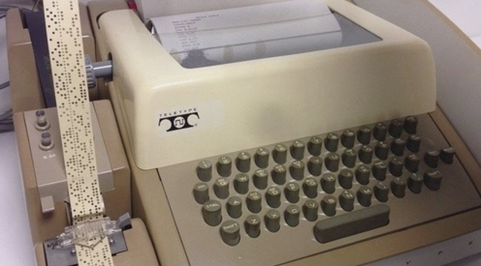
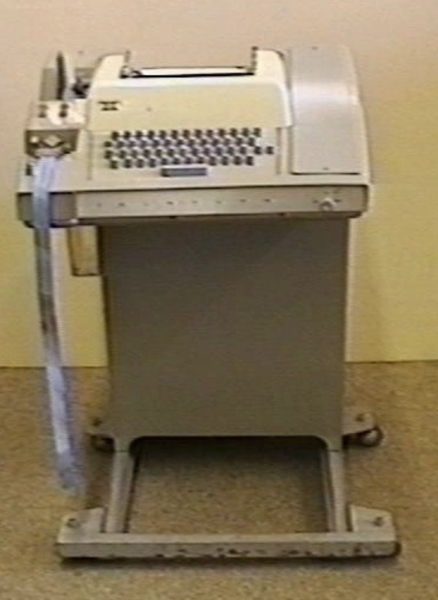
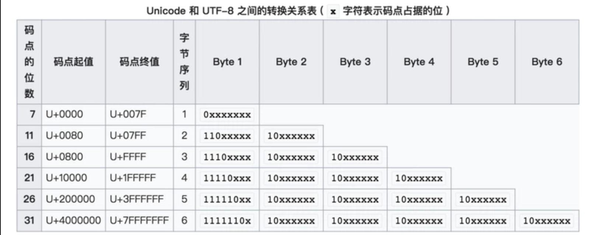

> 这段时间，在github上贡献了一个读取媒体头文件的library，此作者的repos中有很多关于字符编码的库，而且作者很给力，有任何不
懂的问题和想要了解的东西可以给他发issue，热爱讨论，然后我以一个学习者的身份，把关于编码的一些repo fork了下来，顺便和最近正
在读的《隐匿在计算机后的编码》串起来总结一下。

<br />

## 计算机的编码结构

---
计算机说白了就是一个集成电路(Interge circuit)，电路可以形成逻辑，`逻辑`作为形式上的计算机最小运算单元，我们通常把它称作为布尔值。布尔值慕名思意来源于布尔代数，它是数学家布尔发明了用数学表达逻辑的运算方式😂，
发明了很多年之后，布尔代数才与电路相互结合，然后出现我们现在比较熟悉的`逻辑门`，`触发器`，`晶体管`, `加法器`, `继电器`，其实继电器是比计算机出现的早得多，早在电报时期它就被发明出来，主要的目的是刷新电压提高电流以传输得更远，
但是后来继电器不仅仅是`继电`那么简单，玩法开始越来越多，这个后面会提一下。
以上只是随便说了点历史和硬件，这里只需了解电路和二进制和逻辑的关系，逻辑最小可解构为两个部分，分别为1,0，也就是是或者否，二进制表示为0或者1，它们完全符合电路的打开和闭合的规则。所以任何事情在计算机中，都无非是电路的闭合或开关组成的。

### 了解名词

`码元(Code Unit)`
`Unicode平面`
`字符映射（character map）`
`字节序`
`前导位`

### 二进制(Binary)
通过上面，我们知道二进制只是符合计算机运算规律的进制数，
就好比我们人类擅长使用10进制来计算一样，我们在代码中一般都会使用10进制数字进行运行，甚至是8进制，16进制等等各类表示方法，
总之怎么方便计算，方便表示，我们就用几进制，但是总归该是要转换成2进制给计算机的，这也就是我们编译器做的事情，对于运行时语言，
则又多了一层`控制层语言`也就是母语言，就比如js的外面包裹着c++。

### Unicode

我们不能在计算机中直接输入二进制来下命令，因为它不符合我们的大脑意识，也就影响了效率，所以我们需要搞出一个更易于人类使用。那我们需要一个可以转换字符的工具，
把我们熟悉的字符比如中文和abcd转换到二进制，这就是Unicode码的作用，自11.0版本以来，Unicode已经支持了十三万多个字符，也包含了很多小语种，它是一个映射表(mapping table)，
从码点(code point)映射到字形(glyphs)，我们输入的每个字母，这个字母的字形对应到一个唯一的code point，关于字形与code point的对应，可以参考[Unicdeo官方文档][1]，
这里只需了解每个字形(不受字体样式的影响)都对应一个码点，这就是unicode做的事情。
code point的设计也很好理解，它是纯数字，从0开始递增，分别表示各个国家的各种语言字符，大致分两个部分，一个是`无字形`编码主要用于格式的处理和一些在特定系统和编码下的功能键，
它被分为c0和c1两个部分，比如换行的code point就是10，属于c0部分，另一个部分属于`有字形`部分，就像我们刚才说的，它们都对应一个特殊的glyphs(字体图形)，其中就有Ascill。

#### Ascii码
Ascii的历史有点远了，最初的设计也是为了`电传打字机`，附图:
，

看不清？来个放大版的。
，

看起来，它只是一个输出设备，可以使用键盘打字，然后输出到纸上。

Ascii码和uncide一样也是通过数字来映射对应的字符(这是毋庸置疑的，就像我们上面说的计算机的本源就是`断开`和`闭合`，只不过上层我们习惯用十进制，底层是二进制)，起初它的范围只有0-127，也就是128个字符，Ascii码也正是从0-127对应这128个Ascii字符的，我们平时的书写格式有很多种，比如换行，空格，制表符，等等。Ascii的前32个字符就是这种**无实际字形的码点**，它只表示文本的格式，再之后的字符就是一些标点符号和阿拉伯数字，和拉丁字母(Latin Letter)，拉丁字母支持大小写，具体请查看[here][2]。

Ascii前期只有128个字符，同期也有很多和它相似的编码，比如`ISO 646`，它支持除了Ascii支持的编码外更多国家的字符，也有很多编码支持的因为它在西方的字符通用性(Latin letter 在西方使用广泛)被使用的越来越多，

Ascii和Unicode的交集就在于这128个字符，Unicode的前128个字符也恰恰采用了这些字符，对于前期的Ascii码是完全兼容Unicode的，或者说Unicode就是Ascii码的超集(Superset)，

但是对于`扩展的Ascii字符(Extended Ascii Codes)`，Unicode并没有对应，我想或许这是因为Unicode定义晚于扩展的Ascii字符。

我们可以通过javascript打印看一下32个字符是没有字形的，并且可以发现前128个字符是完全和Ascii码相等的。

### 上层编码

---
Unicode只是提供了一个映射表(Map table)，直接使用它来解决`两种语言`(Binary 和 字符)的转换中间还差了一道工序。想象一下假如让我们来使用Unicode码来设计一个刚才的打字机？

我现在想打印四个字：`我喜欢你`，我们使用打字机输入四个字符，然后打字机通过使用Unicode的Map把他们转换成字符序列.


```
11000100,0010001 // 我
10101011,0011100 // 喜
11010110,0100010 // 欢
10011110,1100000 // 你
```

假如我们没有任何修饰符，我们将这些二进制序列合起来就是通过unicode转换出来的这四个字。

但把它们放在一起，会出现一个问题。比如，我们把`我`字第一个字节的序列拿出来，同样也是一个字符。

```javascript
String.fromCodePoint(parseInt("11000100",2)); // "Ä"
```

所以，计算机不知道到底多少个字节才是一个字符，一定要有一个上层规范再包装一下Uicode的这个映射表，计算机才能更清晰正确的组合这些bit。
我们比较常用的 UTF系列和GBK，windows UCS等等很多编码，它们其实都是处理的这部分事情，最大不同点是`它们的算法(组合序列映射为字符的算法)不一样，支持的字符也不相同`。

大部分我们熟知的编码都是`为了建立在更少的码点占用内存和查找效率的基础上，更好的解析不同场景的Unicode码`。比如下面

#### Utf-8，Utf-16，Utf-32
`UTF(Unicode Transformation Format)`系列编码直译为Unicode转换格式。它们基于Unicode定义了一些自己的规则。

#### UTF-8
Utf-8与ASCII完全兼容，它的定义规则是这样的，贴一张图。

#### UTF-16
#### UTF-32
#### GBK
#### UCS
#### Big

### 编码可能导致的问题

---
#### 乱码
 编码出现的地方有两种，我们在代码编辑器中编辑时的编码，解析时编码，比如HTML中的元标签(meta)第一行我们通常都会指定一个charset。
 
总之，编码也就是两部分，第一是你用什么编码写入的这个文件，第二是运行上下文使用什么编码来解析这个文件，两头对不上，那就会出现乱码的情况。
#### 看起来一模一样，但却不相等？
#### 看着没什么，但

### 加密编码

---
加密编码和上面说的普通编码不同，前者为了保护数据，后者为了显示。
对于非对称加密，加密有 SHA, SHA-1, MD5, HEX, 我通常叫这种加密方式为`加盐`。

对称编码，和对称加密，我们熟知的base64和Zip压缩算法等等，对称加密就需要提供一对秘钥

### 如何互相转各类编码
对于各类的上层编码我们应该如何转换呢？

### With JavaScript
**千万不要被字符表象所迷惑，时刻铭记着，屏幕上的字符只是CodePoint的映射(Map)**。
```javascript
var s = String.fromCharCode(1)
var d = String.fromCharCode(3);
console.log(d) // ""
console.log(s) // ""
s === ""; //false
d === ""; //false
s > d; // false
d > s; //true
```
由于32码点之内的字符是`无字形`的，所以我们打印出来并不能看到什么，但实际上在比较时，引擎还是以codePoint为准。自然排序也就是Sort方法也是比较码点了。
我们可以在代码中直接使用Unicode码，这需要使用\u前缀标明接下来应该被识别为对应`编码类型`的转义后的字符。

### With Python
```pyton
def uu() {

}
```
