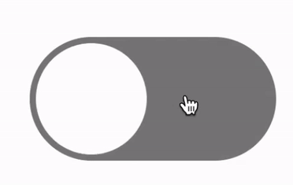
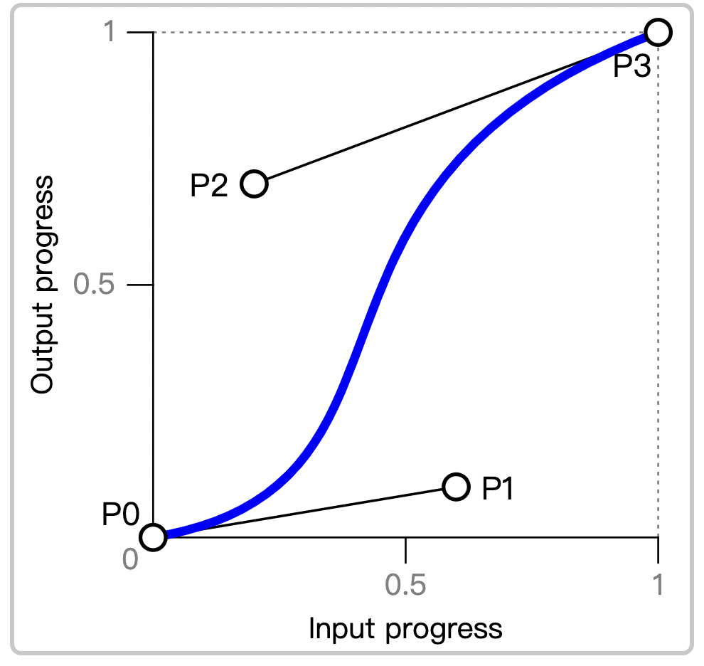
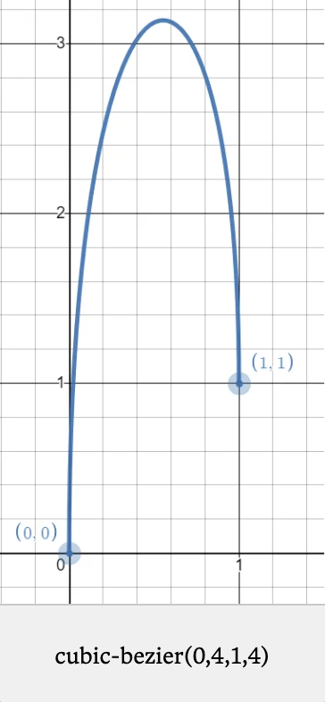
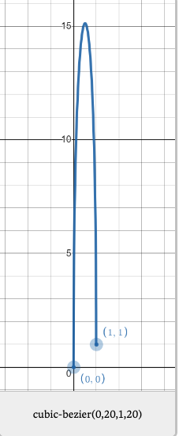

说缓动函数之前呢，先看下一个饿了么的css添加购物车的效果图，这是很多年前我使用纯CSS的bezier函数实现的，
本章主要探索贝塞尔曲线的使用和原理，下图项目的仓库在[这里](https://github.com/TongDaDa/ele_shoppinng).

  

用CSS实现这样一个动画，在没有贝塞尔的帮助几乎是不可能实现的，而贝塞尔曲线很少有人关注可以配合CSS实现很多
炫酷的效果，实际上在一些细腻的, 符合**真实物理反馈**的交互动画上，可以配合选择出不同的物理效果，除了上面的购物车动画效果外，像下面这个滑动的按钮也可以用CSS实现。

  

## Bezier 曲线介绍

贝塞尔曲线最早在20世纪60年代，法国汽车工业时期发明的，主要也是为了解决车身的工业设计，因为汽车的图形是流线型的，
之后便一直沿用在计算机图形领域。

在计算机中可以计算两点间的直线距离，但曲线由于不确定性，是没有固定的算法表示的，这对在计算机中绘制矢量图形是非常重要的。
因为不管录入曲线信息和传输曲线信息，不可能靠点连成线的方法，而一定是靠着一种由推算规则完成的算法，可以减少很多的存储
和表达成本。这也是它出现的意义。

  

在贝塞尔二次曲线中，绘制一条曲线，通过不断计算t的位置，形成一条曲线，绿色的是调节点，
假如绿色的线不超过P0和P2，那么永远也不可能超过它们的象限。

所以单就Bezier曲线来说，它不是某一个特定技术的代名词，而是计算机中表示曲线的一种方法。不管做图表
，动画，绘制不规则图形，都可以用这个方案来实现。

它也是绘制流线型曲线的最广泛方式，在 `Adobe Illustrate` 和 `PS` 中的曲线绘制都使用它来完成。
例如，在PS中的**钢笔**工具。

## 在CSS中的应用

在css中的动画中，有运动轨迹一说，从A点移动到B点时候，是保持线性平均速度，还是先快后慢，或者是先慢后快，可以通过 `animation-timing-function`, 或者`transition-time-function`属性来实现。它表示对某一个动画的运行轨迹。

如果要使用贝塞尔曲线的话，需要调用CSS的内置函数，`cubic-bezier`方法。

`cubic-bezier` 函数使用的是二次贝塞尔曲线，两个对点(p0和p3)带两个调节点(p1, p2)，也就是四个参数，一般叫 P0 - P3。

需要注意的是，函数的参数是这么排列的， 不是从0-1，这么排列的好处是，一般P0和P3作为起始点和终点，不怎么调，P1和P2作为
调节点，会频繁改动，所以把P3放到了前边，便于查看和编写。

`cubic-bezier(p0, p1, p3, p2)`

  

横轴表示时间，也就是P0,P3，从0-1。竖轴表示运动进度，一般是0-1，如果两个调节点都在1以内，不会使曲线超过设定的运动轨迹。也不会打乱原来的运行/时间的节奏。但如果超过了1之后，动画的运动就会变得溢出了。

什么叫溢出呢，假如一个球横向运动一个`10S`的动画，从`0px`移动到`100px`的位置，那么如果P1和P2设置成了`4`, 这个球的
动画部分依然运动到100px的位置，但是由于运行轨迹超出了1最大值，运动距离会相应的多出一部分(这部分不会算入动画部分内，只在运行时有对应峡谷)，
整个运行时间不会发生改变。

也就是说，P1和P2可以超出1，但是超出后会对影响原来的动作执行时间，按照超出的程度，重新规划整个运动轨迹。

由于0,4,1,4是一个山峰型的轨迹，一个典型的快-慢-快的运行轨迹，我们就可以利用这个机制制作出CSS Animation 本身不能实现的不规则运动轨迹动画。
通过它，我们可以实现任何使用二次贝塞尔曲线可以画出的轨迹的动画。

  

会发现，由于0,1和1,1之间差了一个点，所以动画的没有平均分布在整个时间轴上，在尾部有点断层。这种情况可以使用big value hack的方式，最大化缩小`0-1`间的轴距。

比如我们用`20`来替代上面的`4`, 会变成下面的效果图。

  

有了曲线的运动方法，就可以利用多动画执行来实现多个方向的位移，下面这个就是利用x和y的两个动画实现山峰型的运行轨迹，x是正常动画，y是使用贝塞尔曲线。

<iframe src="//codepen.io/anon/embed/ZEeYzNy?height=450&theme-id=1&slug-hash=ZEeYzNy&default-tab=result" width="100%" height="400px"> 
</iframe>

## 总结: 应用场景和实用工具

饿了么加入购物车的动画效果和这个如出一辙，本质上都利用贝塞尔的不规则运动来突破 CSS Animation 实现不了的不规则运动限制。，可以通过贝塞尔曲线实现一些非平行的运行场景，一般分为ABC三个阶段，加入购物车的效果也是从快-慢-快只不过使用了贝塞尔曲线之后可以使DOM元素在位置上发生变化。

介绍一些常用的贝塞尔曲线生成工具，https://cubic-bezier.com/#0,0,1,1 是一个在线绘制贝塞尔曲线，即使浏览CSS效果的在线工具，常规的动画可以配合UI使用这个
工具研究一些自定义的运动效果。

如果是像上面的效果，在这个工具上不太好操作，需要手动调试，如果理解了二次贝塞尔的曲线规则，很容易脑补出运行轨迹，所以也不是什么难事。

