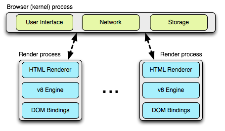
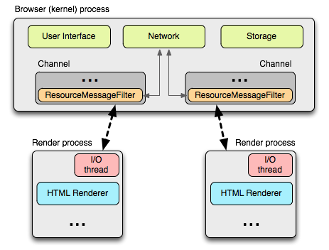
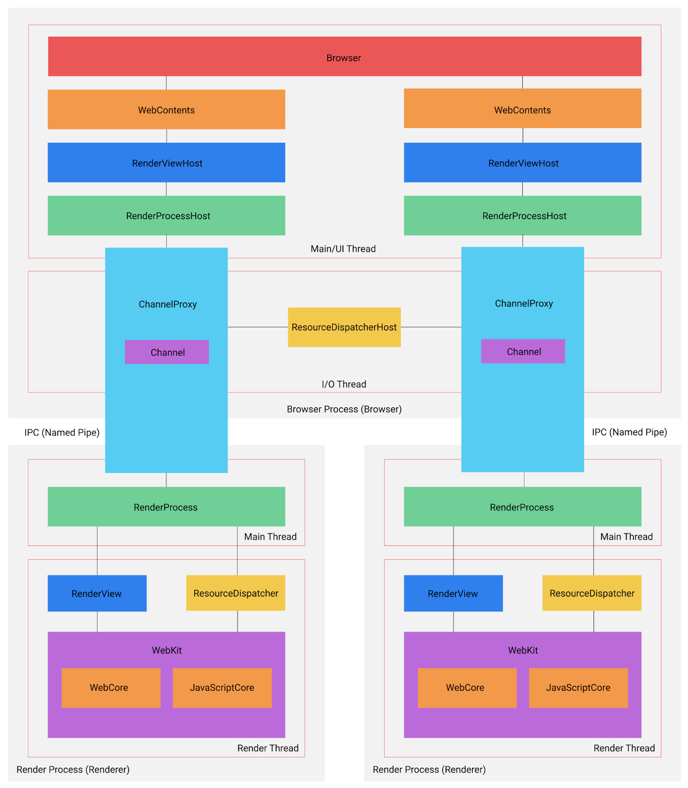
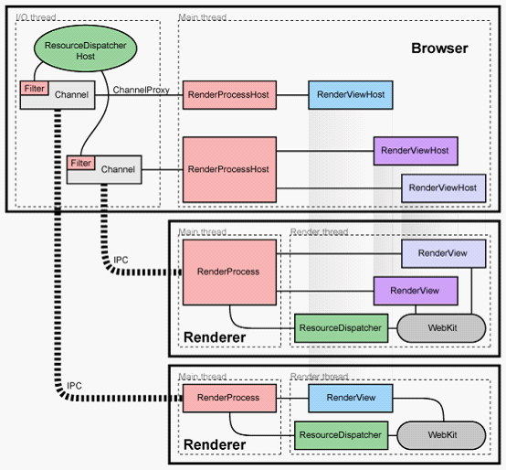
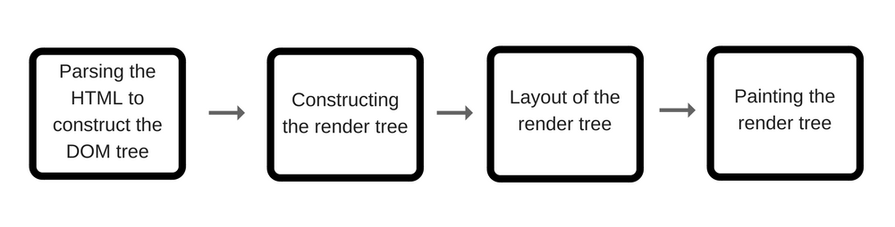
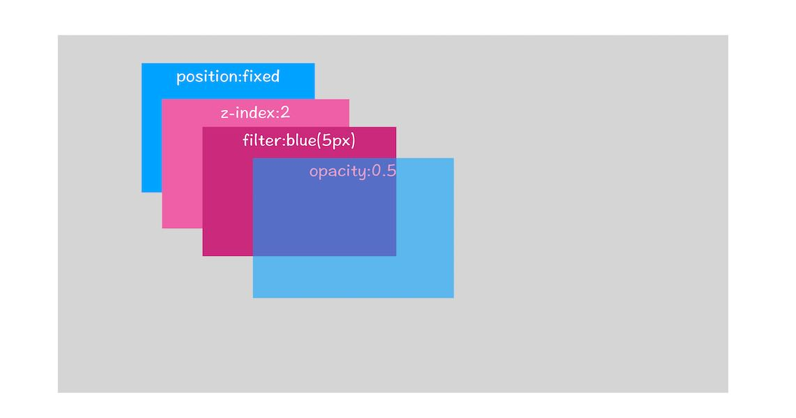
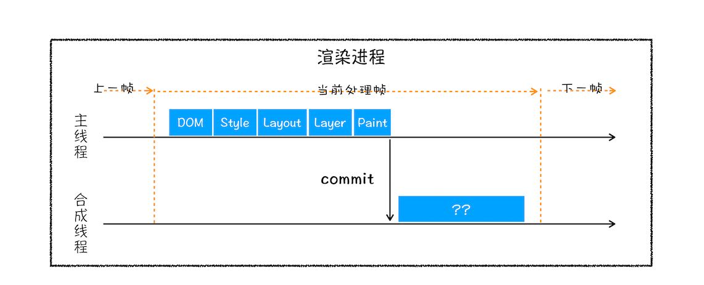
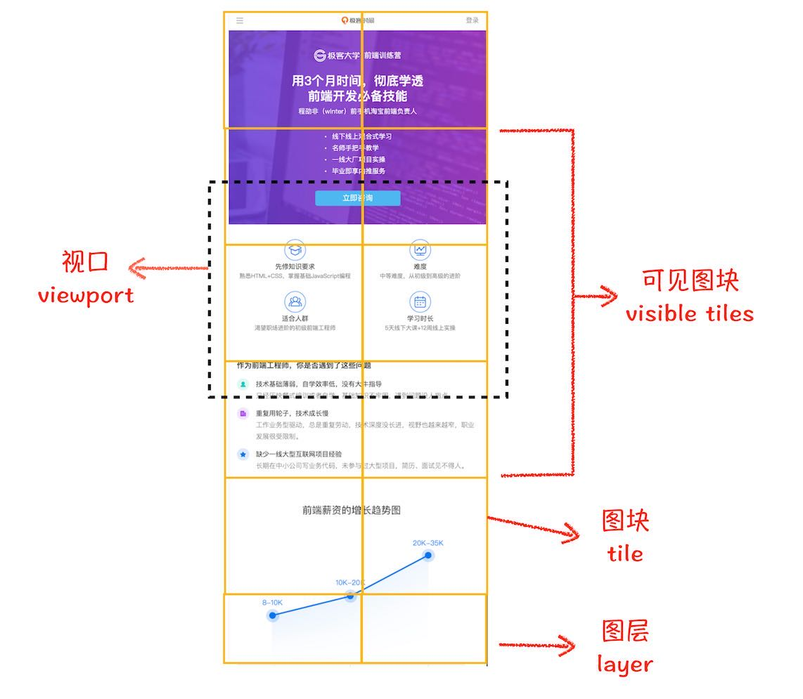
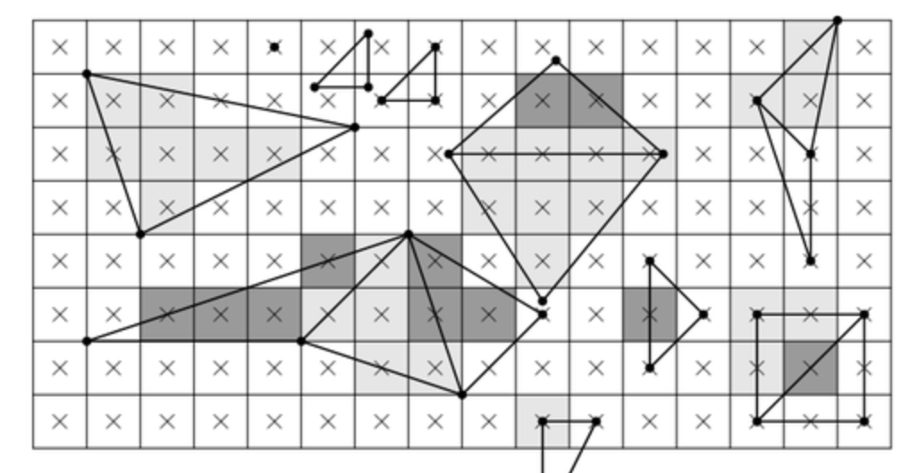

## 前言

此篇文章中所述的内容，未经过源码级的考核，像webpack一样，没有绝对的教材，对频繁改版的chromium也是如此，以下仅凭个人的一些思考，实践，参阅(Chromium官方文档)，推导出来的，
所以，内容有可能并不完全正确。

此篇内容主要参考Webkit架构，早期的开源世界中，它被Apple创造出来，之后Google投入大量人力开发人员融入Webkit项目，熟悉webkit代码，
几年后，Google开发者们在这个项目中的提交量占据了一大半，成为了核心维护者。之后他们把Webkit fork 下来，为自己的多进程架构重构， 并更名为Blink(同webkit为浏览器内核), 
为什么要fork下来，而不在原有的webkit上做多进程架构欧呢？主要有两个原因，

1. webkit应用场景和google要发展的方向不匹配，webkit作为一个开源的浏览器内核，提供嵌入式接口(高达几百个)，
而Google想商业化自己的浏览器，前者是面向开发者，后者面向用户。用户并不关心内部实现，而开发者需要关心，webkit如果改了架构，
这对开发者极不友好(对于开发者来说，了解这么庞大的一个内核是需要花费很多的时间的)。所以google决定自己做，不受制与人。

2. google想提高自己产品的地位并且控制浏览器市场，这是它从开源试炼者到浏览器标准引导者的分水岭，Chromium内核Blink的开源不是情怀，是想让更多的浏览器厂商
为之动摇，用他们自己的浏览器内核(Blink)，这样，它就有能力控制浏览器市场，占据有利的市场份额。

在Chromium重构之后，Webkit开发团队一看，这个架构不错，但对于他来说改动太多(由于webkit是浏览器大风起时最流行的浏览器内核，很多
厂商都基于它开发，所以不适合做大的变动)，结果自己也搞了一个多进程架构(效果并不理想)，并更名为Webkit2。下面会说到它的基础架构。

--- 

在多进程架构出现之前，浏览器的每个tab都是揉在一起的，这导致如果一个tab中的页面出现了未知错误，如果内部出现一个`uncaughtError`，整个
浏览器就有可能全退了，用户需要再次打开浏览器。对于浏览器软件架构的设计理念 -- `速度`，`安全`，`稳定`，`易用`，是极其不符的，因为
如果出现了安全漏洞所有渲染进程都是一条绳上的蚂蚱，很不稳定。

出于以上原因，Chromium从应用的视角变成了平台，技术架构也随之发生了改变，他们把一部分任务分摊开，如果是render进程出现的错误，
则在对应的tab上弹出一个页面崩溃的提示，点击确定之后，此tab就会消失，也就是对应的渲染进程。所以对于用户体验来说，多进程架构是有好的，
可行的。如图

<p class="text-center">
  
</p>

一个 Browser 进程，和若干个render进程(上图示例为两个)，render进程就是我们在浏览器中打开的tab，所以render进程和tab是一一对应的关系(实际上某些
特殊情况下有很多其他策略，比如同源一个Render进程)。

<p class="text-center">
  
</p>

这完全符合平台化的chromium设计，把每个渲染进程，也就是用户(开发者)的脚本运行的环境，打造成一个沙盒，这里所有涉及网络安全和本地存储等
安全风险较大的模块，全部通过IPC发送给Browser进程去处理。而每个渲染进程中又有一些线程，比如IO线程和主线程(上图为HTML Renderer)，主线程我们不陌生，
IO线程主要与Browser进程通讯。下面会介绍各个线程的作用。

**简要和通俗的概述一下线程和进程之间的关系**，进程是cpu执行一次任务的最小单元，但一个进程是有上下文的，也不可能只让cpu执行一次，所以cpu多次执行时，进程需要保存此程序的上下文，等待下次执行。而进程从我们
单纯的"提高计算力"维度来说是过于庞大的，因为每次都需要保存上下文，等待下一次cpu的宠幸，这时，一些系统就开放了一个线程的概念，线程不用保存这个上下文，并且寄存在进程中，线程中能够很容易的互相通讯，
而且还可以让cpu执行它的任务。所以总结来说，进程和线程都是一个时间段的描述，是CPU工作时间段的描述，不过是颗粒大小不同。

注：以下进程模型基于PC版本的Chromium，对于Android版本有些不同，GPU进程变成了浏览器进程中的一个线程（为了节省资源，毕竟手机和pc硬件性能还是有区别的），Render进程
会演变成Android上的服务进程。其Render进程的数量也不会是一个tab一个，会把当前不用的render进程变成`影子(Phantom)标签`, 也就是再次访问时会重新加载和渲染。

## 浏览器进程和渲染进程

<p class="text-center">
  
</p>

### 浏览器进程

从上图中可以看出浏览器进程中大致可以分为两个线程，主线程(UI线程)用于处理从浏览器界面的交互到衍生出一个渲染进程，
而IO线程，用于渲染进程和的消息传输。

#### UI/主线程

WebContents使用过`electron`的同学会熟悉一点，它表示的就是网页内容，但并不能向`NW.js`访问一个页面的上下文对象，只能通过IPC去通信。
由于一个页面有可能还会打开一个小窗口(window.open)所以这里这个名字是复数形式。也就是说创建一个渲染继承呢好难过之前，
必定创建一个`WebContents`实例。

`WebContents`上层大致有RenderViewHost，和RenderProcessHost两个类(如果细化大概有十几个类名)，但RenderViewHost并不是和WebContents
一一对应的关系。

RenderViewHost表示从一个url输入到加载完毕(tab页上的小圈停止转动，`onload`事件)这个过程中的状态管理。大致分为三个状态，start, commit, finish.
开始解析url为start，然后进入commit阶段，它检测是否为合法地址或ssl证书失效，如果非法就直接render失败信息(常见的在chrome中输入url然后直接提示你
不存在的url或不可访问的地址等等都是在这个阶段检测的)，如果通过检测，就去解析从这个url中获取的内容(通常为HTML格式)，当把所有网络资源加载完毕，
此时到了finish阶段。这就是一个`RenderViewHost`实例的生命周期。

那么为什么一个webContents有可能对应多个RenderViewHost呢？因为一个页面中还会导航到另一个地址，这时为了缓存策略，不能直接舍弃掉当前已经加载好了的这个RenderViewHost，
当我们用 `History API` 或点击浏览器的后退按钮时，会直接把之前的页面渲染状态呈现出来，**而不是重新加载一遍**（这一点大多数人在浏览网页时都体会得到）。
所以RenderViewHost实例是和历史访问的条数对应的。下面再来一张多`RenderViewHost`的图。

<p class="text-center">
  
</p>

上图中browser进程中也有两个RenderProcessHost实例（个数对应渲染进程），第二个RenderProcessHost拥有两个RenderViewHost，说明它有一个历史访问页面。

而RenderProcessHost主要用于给RenderProcess发送请求和处理来自Render进程处理的结果。

#### IO线程

IO线程没什么好说的，主要负责和渲染，GPU进程通信

### 渲染进程

渲染进程是浏览器中的大动脉，动脉内是整个页面中的`网络资源`，`本地存储`，`渲染层级树（Render Layer Tree）`，运送到心脏中处理（browser进程）
而每个动脉旁还有一些静脉，也就是线程，每个渲染进程中中至少有四个线程，根据不同的上下文还会创建更多的线程。

下面来看看各个线程中负责的工作。

#### Main/Rendering thread -- Webkit/Blink thread

`Blink`属于浏览器内核，除了渲染的工作之外，还有使用V8引擎`执行JS的责任`在身，
它们不仅具备渲染引擎（webCore），也具备javascript`运行时`的能力（javascriptCore）。

 > 这里顺便说一下，很多误认为浏览器里的接口window下的接口就是JS引擎的能力，JS引擎形容的是可以执行`纯`Javascript代码，
 纯js代码请参考EcmaScript标准文档，而浏览器环境和NodeJS环境只不过是维护了一套Javascript运行时能力，并赋予了一些平台的接口(对于nodejs来说是libuv模块)，就拿setTimeOut和事件
 队列来说，他们都属于运行时提供的，并不属于js引擎范畴内。
 
 Blink引入V8引擎之外有一套自己的Javascript运行时，我们可以理解为它是 `浏览器环境(DOM，BOM，动画方法，SVG，Canvas接口等等)`
 和`JS引擎的胶水层`。它们互相提供一个接口，js可以访问浏览器环境（用js做动画），渲染模块也可以调用js(解析dom时，碰到script标签)。

也正是因为渲染引擎和JS引擎由`运行时`互通着，所以没办法把他们单独拆成不同的线程。
 
对于渲染，主线程主要使用`它`来解析`HTML`，整合DOM树和生成渲染树，对于从解析HTML到生成`渲染对象树（Render Object Tree）`，
可以简单的分为以下几个阶段。



下面介绍一些`RenderObject`和`RenderLayer`和在`Chromium的多进程架构`下的渲染方式，
由于本章主题不在渲染原理，所以这里只简要概括Render/Layer Object，不深入原理，之后会有单独的文章分析它们的原理。
以下我分为四个步骤，对应图上的四步，进一步解释各个环节所做的事情。

1. 解析HTML生成DOM树，这属于Render进程工作的第一步，大多数开发者都能理解，这里不做赘述。
2. 生成完DOM树，内核会使用`NodeRenderingContext`类来创建对应的`RenderObject`, 每个RenderObject中分为三个阶段绘制自己
第一阶段绘制背景和边框，然后是浮动内容，其次是前景(内容部分，还有子元素的背景，边框，前景)，
然后生成`RenderObjectTree`（一颗新树，结构和DOM节点一样，也会有firstChild, nextSibling, removeChild等操作）。
RenderObject非常重要，它用来描述一个`可视化DOM节点`和其`CSS样式`融合后的描述对象，同时
也`解析对应DOM节点的css脚本`，储存为了绘制DOM节点所需要的各种信息（就好像一个渲染引擎的API，另一个内部的表现形式），
经过内核处理后就知道如何绘制了，这个对象中有大致有如下信息：

```
addChild()
drawLineForBoxSide()
AddPDFURLRect()
paint()
repaint()
```

除了上面这些，RenderObject中还有很多方法，它们储存这如何绘制自己的`逻辑`, 最终内核会调用这个方法（RenderObject内部方法实际上调用了GraphicContext类的接口做实际的绘图操作
`一个c++渲染引擎`, 这个之后会说到）生成完这个`渲染树(Render Object Tree)`，一些抽象的css样式方法(比如各种布局，位置，浮动，节点间互相带来的样式作用)
已经处理得差不多了，都转换成了renderObject的表现形式。

3. 然而，**软件层面是有层（HTML，PS）的概念，但对渲染来说都要合成一个图片，最终表示一个帧图像**。
那么这时内核怎么去合成这些层呢？首先`层`已经有了，就是我们上面的RenderObject，一个树形结构，从内到外一层层渲染就可以，
但是一般情况下`渲染树（Render Object Tree)`过于庞大和复杂，为每一个RenderObject都生成一层，然后再去`合成渲染`的话，`FPS`肯过不了60。
其次，从内到外渲染只是从**dom层面**上的`上下`的关系，在css中`z-index`就属于例外，因为它可以让原本应该在下边的上级兄弟元素在上面，所以不能
单纯从DOM结构上(也就是Render Object Tree)决定渲染的层级关系。



所以，接下来需要一个`包含层级关系的列表结构`(不是树，树的概念是递归性的，这个表示层的结构是平行的)，把`样式表中的层级关系`融入进来，这就是`RenderLayerTree`，
它是根据`渲染树（Render Object Tree）`生成的列表，只有拥有以下属性的节点可以成为一个`RenderLayer`，也就是说，他们的对应关系是一对多的。
 
  - Document中的根节点（可以理解为html标签）
  - 使用了定位属性并指定了一个`固定`的位置的节点(这里普及一个小知识点，定位属性不会脱离文档流，只有真正的指定位置时才会发生)。
  - 使用了透明度属性或者filter属性添加了过滤效果的。
  - 使用了overflow属性。
  - 使用了Canvas的2D,3D绘制的节点。
  - 使用了Video标签的节点

以上这些条件，我们暂且叫它们为`RenderLayerTree Reasons`, 符合它们的`RenderObject`们将会构成**一个** `RenderLayer`， 它是`数个RenderObject的集合`，
多个RenderLayer摞在一起就是`RenderLayerTree`。(RenderLayerTree的第一个RenderLayer对应的文档的根节点，之后的层的层级越来越高，所以在它最下面的在视觉层面是`上面`)

4. 目前为止，已经有三个树，`DOM Tree`, `RenderObjectTree`, `RenderLayerTree`，貌似已经完全可以概括渲染页面的前半部分(还没到绘制和展示)。
但还是不够，webkit再次抽象化`RenderLayerTree`，所以，符合如下条件的`RenderLayer`会被
合成一个`GraphicsLayer`(实际上每个RenderLayer都有能力转换成一个GraphicsLayer，并且在`软件渲染`时，不会生成GraphicLayer, 这个后面会说)，我们称这些条件为 `Compositing Reasons` 这些全部的条件可以在[Chromium源码](https://source.chromium.org/chromium/chromium/src/+/master:third_party/blink/renderer/platform/graphics/compositing_reasons.cc;l=14?q=CompositingReason&sq=&ss=chromium&originalUrl=https:%2F%2Fcs.chromium.org%2F)中找到.
下面是我粘出来并且精简后的一些比较常见的规则，每一个条件后面都会有一个描述。

```c
constexpr CompositingReasonStringMap kCompositingReasonsStringMap[] = {
    {CompositingReason::k3DTransform, "transform3D", "Has a 3d transform"},
    {CompositingReason::kTrivial3DTransform, "trivialTransform3D",
     "Has a trivial 3d transform"},
    {CompositingReason::kVideo, "video", "Is an accelerated video"},
    {CompositingReason::kCanvas, "canvas",
     "Is an accelerated canvas, or is a display list backed canvas that was "
     "promoted to a layer based on a performance heuristic."},
    {CompositingReason::kBackfaceVisibilityHidden, "backfaceVisibilityHidden",
     "Has backface-visibility: hidden"},
    {CompositingReason::kActiveTransformAnimation, "activeTransformAnimation",
     "Has an active accelerated transform animation or transition"},
    {CompositingReason::kActiveOpacityAnimation, "activeOpacityAnimation",
     "Has an active accelerated opacity animation or transition"},
    {CompositingReason::kActiveFilterAnimation, "activeFilterAnimation",
     "Has an active accelerated filter animation or transition"},
    {CompositingReason::kActiveBackdropFilterAnimation,
     "activeBackdropFilterAnimation",
     "Has an active accelerated backdrop filter animation or transition"},
    {CompositingReason::kXrOverlay, "xrOverlay",
     "Is DOM overlay for WebXR immersive-ar mode"},
    {CompositingReason::kVideoOverlay, "videoOverlay",
     "Is overlay controls for video"},
    {CompositingReason::kWillChangeTransform, "willChangeTransform",
     "Has a will-change: transform compositing hint"},
    {CompositingReason::kWillChangeOpacity, "willChangeOpacity",
     "Has a will-change: opacity compositing hint"},
    {CompositingReason::kWillChangeFilter, "willChangeFilter",
     "Has a will-change: filter compositing hint"},
    {CompositingReason::kWillChangeBackdropFilter, "willChangeBackdropFilter",
     "Has a will-change: backdrop-filter compositing hint"},
    {CompositingReason::kWillChangeOther, "willChangeOther",
     "Has a will-change compositing hint other than transform and opacity"},
    {CompositingReason::kAssumedOverlap, "assumedOverlap",
     "Might overlap other composited content"},
    {CompositingReason::kOverlap, "overlap",
     "Overlaps other composited content"},
    {CompositingReason::kNegativeZIndexChildren, "negativeZIndexChildren",
     "Parent with composited negative z-index content"},
    {CompositingReason::kOpacityWithCompositedDescendants,
     "opacityWithCompositedDescendants",
     "Has opacity that needs to be applied by compositor because of composited "
     "descendants"},
    {CompositingReason::kMaskWithCompositedDescendants,
     "maskWithCompositedDescendants",
     "Has a mask that needs to be known by compositor because of composited "
     "descendants"},
    {CompositingReason::kLayerForForeground, "layerForForeground",
     "Secondary layer, to contain any normal flow and positive z-index "
     "contents on top of a negative z-index layer"},
    {CompositingReason::kLayerForMask, "layerForMask",
     "Secondary layer, to contain the mask contents"},
    {CompositingReason::kLayerForDecoration, "layerForDecoration",
     "Layer painted on top of other layers as decoration"},
    {CompositingReason::kLayerForOther, "layerForOther",
     "Layer for link highlight, frame overlay, etc."},
    {CompositingReason::kBackfaceInvisibility3DAncestor,
     "BackfaceInvisibility3DAncestor",
     "Ancestor in same 3D rendering context has a hidden backface"},
};
```

到了这里，可能有些同学会烦了，会啥一直转换这些数据格式？每个图形绘制逻辑不都在RenderObject里吗, 转这么多格式也没处理多少事情呀？其实这些都是
优化的操作，在面临`上层(css，html5)`可以使用的一些`硬件加速的渲染`逻辑需要为它们特殊处理。下面我说两个原因

- 避免不必要的重绘，比如我现在的页面中有两个个Layer。在生成某一帧的显示中， Layer1的元素发生了变化，Layer 2的元素没有发生变化。
   这时候在检测到哪个RenderObject发生改变了之后，只需要重新绘制Layer 1的内容，然后再与Layer 2原有的内容进行合成，
   就可以得到整个网页的内容。这样就可以避免对没有发生变化的Layer 2进行不必要的绘制。

- 利用硬件加速高效单独实现某些UI特性。例如网页的某一个Layer设置了可滚动、3D变换、透明度或者滤镜，那么就可以通过GPU来高效实现。

当RenderLayer合成GraphicLayer之后，才会提供GraphicsContext环境，这里面会使用`c++渲染引擎`接口去渲染。
GraphicLayer可以被表示为一个有`后端存储`的图层，因此可以将它看作是一个图形缓冲区。在`软件渲染`方式中，
这个图形缓冲区就是一块CPU内存，在`硬件渲染`方式中，这个图形缓冲区就是一个OpenGL里面的一个Frame Buffer Object（FBO），
占用的有就是GPU的内存。


主线程渲染工作：**HTML string -> DOM tree -> Calculated Style -> Layout -> Layer -> Paint**



到这里我们基本完成了渲染整个流程的**前半部分**, 也就是在主线程的工作，剩下的就交给`合成线程`了。

#### 合成线程(Compositor thread)

主线程在做了上述一系列的事情之后，然后通知合成线程去内存中根据不同的渲染方式读取刚才塞进去的图像信息，注意主线程
传过来的是 **一整张文档大小的(而不是视口区域内的图像)** 的`GraphicLayerTree`，它不是一张图，而是已经绘制好了的多个图层。以下简称`主图层`。

合成线程主要干两件事：

1. 把`GraphicLayerTree`，分割成一个个小图块(tiles), 如果是用cpu光栅化的话，图块大小为256*256，gpu的话，是 viewPortWidth * 1/4 viewPort Height
，然后把视口区域内的小图块(tiles)发送给`光栅线程`处理光栅化操作。

2. 光栅化完成之后，合成这些层，并裁剪出当前正在浏览的`视口区域`位置和大小的图像。

下图阐明了这两步做的事情(从`极客时间`盗的图)



接下来，我深入说一下上面两个步骤在此线程中的具体操作是怎样的，以及为什么这么做。

Blink会根据`主图层`的大小切分成图块(tiles)，比如假如`主图层`是512/*512像素的，那么就有会分成4个256\*256的图块。
那如果是1:2的比例的话就是，2个256\*256的图，这个操作完全是有合成线程动态管理的，比如说频繁放大缩小已经渲染好的页面，
完全在合成线程中处理，通过事件的捕捉，再去计算应该缩放和放大比例去操作这张`主图层`，给主线程争取更多的执行脚本和重新计算样式的时间。
分割图块是为了在页面的更新中通常只是局部性的 ，**能够节省后面的光栅化和合成操作所带来的内存成本**。


而且每个图块都会有一个**优先级**表示在光栅化期间的处理顺序，并且把这些图块分组，每一组交给**一个**`光栅线程`处理光栅化操作，
这么做主要是为了，在一个快速向下滚动的操作（在主线程已经绘制完毕后，
这其实不需要主线程插手）时，原来的图块还没处理完毕，就刷新出新的区域，所以，在视口区域的区域的图块优先级是最高的。而分组的意义也是在这种情况下能够灵活的操作
一些图块。

光栅化后，合成线程会把的**这些**图层再次**绘制合成一张视口大小的整图**(`Compositor Frame`)，这个操作我们叫 `Draw Quads`。


合成的操作，上面我们提到过一个`c++渲染引擎`，现在可以揭露它的真面目了~~

> 在Blink引擎中，对于2D图形(字体，SVG，css形状，Canvas2D)，它使用的是[Skia](https://github.com/google/skia)引擎，
相比GDI(使用SKia之前的渲染库，Window系统接口)。然而，Skia在同样支持XP，Vista系统的同时，对Blink更加友好（毕竟是Google自己维护）能更快速的渲染
字体等2D图形。

把这些层的图片合成一张图片(类似于PS中的图层概念)。这个事看似简单，但却很有讲究。在`Blink`中乃至`视图渲染领域`大致可以分为三种方式
分别为，`软件渲染`, `硬件加速的合成化渲染`, `使用软件绘图的合成化渲染`，每种方式都有其优点。

> 想合成多个层，必须要依次渲染这些层，渲染指的是把这个层的每个像素信息使用系统指令告诉显示器如何绘制这个`颜色`，而合成需要把这些层中**坐标相同的像素点**依据他们的上下层关系来决定**显示哪个
像素**。简单理解的话，我们脑海中可以想象一个1024*1024的点阵和一个1024\*1024像素的图片，每一个像素代表一项，先读取第一个层的像素信息，渲染完之后，再把第二层的像素信息，覆盖性
的填过去，这里就有一些像素重叠了(合成)。然而这个完成合成这个操作，软件能干，硬件也能干, 软件一般用循环一个个系统的绘图指令绘制像素，走的是cpu(会使用一些合成算法来优化时间)
。硬件一般把这些层的像素信息给到GPU，它利用自身的密集型任务并行处理的优势，能够更快的处理(而且一些GPU本身支持合成层和光栅化)。就好像搬砖，cpu一块块搬，gpu用砖夹子一次可以搬几十块。

--- 

1. 软件渲染在渲染只有2D图形的经典页面中是完全能够胜任的，甚至某些情况下是优于GPU绘制的，因为CPU利用缓存机智有效的减少
重复绘制，而不需要GPU的并行计算，比如，一块小型区域的更新软件渲染只对更新区域处理，而硬件渲染可能需要重新绘制多个层。
但是呢，遇到`WebGL`, `CSS3D`, 视频播放等要求高计算和频繁的绘制渲染，软件渲染就不行了。

2. 硬件加速的合成化渲染使用GPU来完成渲染和合成的操作。

3. 软件绘图的合成化渲染，这种方式在绘制基础的普通图层时使用软件绘制，在使用HTML5 Video, CSS3D 有较高渲染性能要求的时，使用
硬件加速合成渲染。

以上三种方式，在chromium中可以通过添加启动参数`disable-gpu`和`--disable-gpu-compositing`来决定是否启用gpu和使用gpu合成层。在不开启GPU的情况
下，Blink依然可以使用WebGL, 因为它使用了[SwiftShader](https://github.com/google/swiftshader)，一个基于软件渲染的 openGL 接口实现，
但使用这种方式渲染体积较大的图形，有可能会把CPU跑满，页面崩溃几率会很高。

合成完之后，合成线程会发送给GPU他还会发送一个`图像数据段(储存有需要绘制的位置和图像像素信息)`给的Browser进程，表示此次更新的的范围和图像信息，Browser进程拿到这个`图像数据段`之后，
储存在自己的`BackingStorage(一个后端储存功能，用于缓存这个图像的数据)`中，它储存的是一张当前页面的视口区域大小的图像信息(document.documentElement.clientWidth/Height), 
然后Browser进程把这个信息显示到对应的浏览器区域内(此时用户才能看到图像)。假设第二次重绘时，`Blink` 只会把**发生改动的**`图像数据段`发送给browser进程储存到`BackingStorage`中，
然后只更新发生改动的局部区域。

#### 光栅线程(Raster thread)

光栅线程就是做光栅化的操作，它可以衍生出来很多个，每一个线程处理几个图块(tiles)，并且兼顾它们的优先级。
对于光栅化的操作，很多人比较陌生，包括我自己也是，因为普遍认为渲染这个操作就是把图像映射到屏幕上，这只是一个简单的描述，

在计算机图形学中，它分为好几个阶段，进一步划分的化大概是这样：

应用调用 -> 渲染引擎接口 -> 调用系统绘制命令 -> 光栅化 -> 渲染到帧缓存区 -> 显示器上的光源。



实际上在光栅化之前，给到它的是一个图形的轮廓，也就是顶点(Vertex)。比如一个三角形，它就有三个顶点，这个数据可以直接存储在数组中或者将其缓存到GPU内存中。
那么光栅化做的就是把这个轮廓填充相应的像素信息。

#### worker线程

如果脚本中使用`webWorkers`或`serviceWorker`的话，会创建这个线程，用于隔离主线程做一些边缘任务，`这两个线程是不能访问渲染引擎的接口的，所以可以被拎出来作为一个
单独的线程来执行`。

#### IO线程

IO线程主要负责和主进程，GPU进程通信。

## GPU 进程

上面提到的绘制和合成等涉及GPU的操作都是由GPU进程来完成的，但在Android中GPU作为一个Browser进程中的线程存在。

GPU进程会把渲染进程发过来的请求处理结果反馈给它，在非软件渲染条件下，GPU将合成后的一帧直接展示在页面上。

关于渲染和GPU进程相关的实现，Chromium一直在更新，此篇主要总结进程之间的关系，关于渲染原理，上面只提到了一些多进程架构下，
它们互相的关系，但是对于每个阶段的数据格式，和工作流，还是没有展开说。后面我会用例子 + 论证 + 应用层的优化来分析整个渲染
流程。

## 文献：
- [wenkit官方网站](https://webkit.org/blog/)
- [chromium开发者官网](https://developers.google.com/)
- [Chromium Developer Design Document for painting](https://www.chromium.org/developers/design-documents/impl-side-painting)
- [Explore the Magic Behind Google Chrome](https://medium.com/@zicodeng/explore-the-magic-behind-google-chrome-c3563dbd2739)
- [38页的谷歌进程架构概述漫画](https://www.google.com/googlebooks/chrome/big_00.html)
- [Hit Testing](https://www.w3.org/wiki/Hit_Testing)
- [Inside of modern web browser](https://developers.google.com/web/updates/2018/09/inside-browser-part4)
- [Class SkPicture](https://api.skia.org/classSkPicture.html)
- [Graphics and Skia](http://www.chromium.org/developers/design-documents/graphics-and-skia)
- [gpu-accelerated-compositing-in-chrome](https://www.chromium.org/developers/design-documents/gpu-accelerated-compositing-in-chrome)
- [Multithreaded Rasterization](https://www.chromium.org/developers/design-documents/impl-side-painting)
