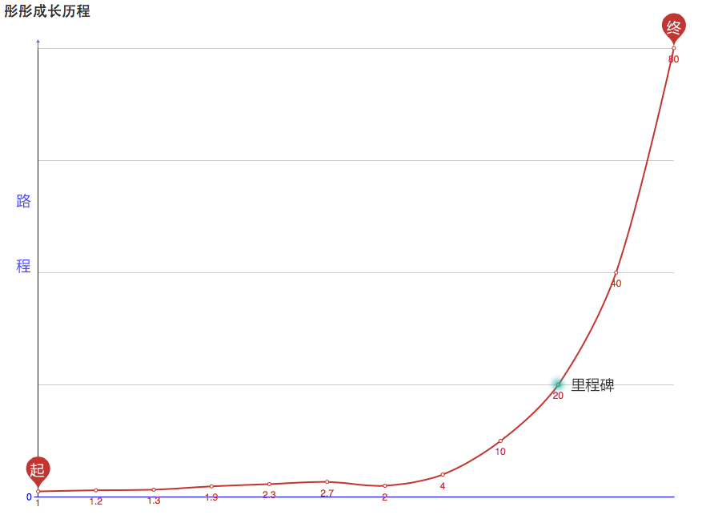
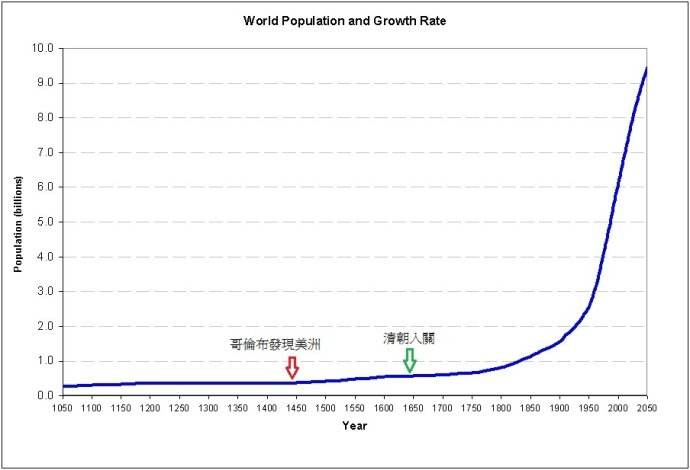
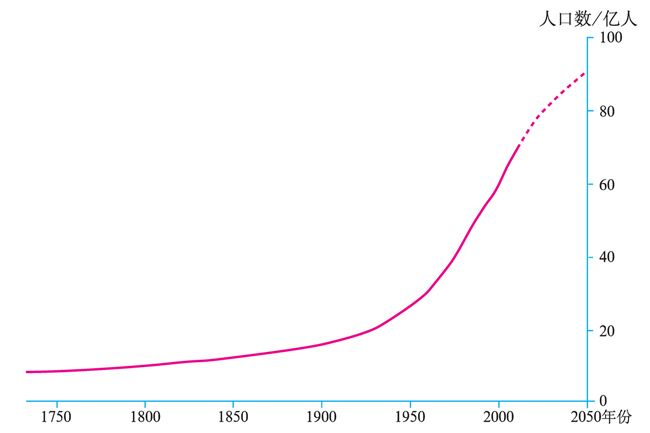

## 前言：
**这个标题附带一份空白的内容，已经在wordpress的草稿箱当中存留了很多天了，一直想写，可是对于那份曲线图的转折点，我一直都是模模糊糊，所以这篇博文，一直留到现在。直到有一天看到财富自由的定义时，我终于明白笑来老师所述的那座里程碑。**
 
## 内容： 
 这条曲线没有特定于某个技能，行业，或者学习曲线。它很宽泛的描述了事物的发展规律，在背后推动它的正是我们上次所说的`复利`现象，下面我们来看看究竟是怎样的一个曲线？
 
 开始之前我们可以自己在心中绘制一个成长曲线，就以从小到大积累的成长为y轴，x轴为时间线。先想象一下吧！
 
 从你开始上学，到大学毕业，再到参加工作，直至中年，那时你可能成为一名商人，一名作家，一个出色的工程师等… 不管什么职业，但有一点可以肯定的是你比以前成熟了，收入高了，也看透了许多。当然，你肯定成长了，而且每次`升级`都是基于上次的`经验值`来完成的。
 
 所以说只要不断的积累，就会出现成长曲线不断上升的现象。
 

 (图中数字表示我的历程与未来规划的成长增幅比例，并不是年龄哦!) 

对于大多数人，在工作已久的岗位中无法获得成长，而图中的那个里程碑正是你的转折点，即“财富自由”。

这很有意思，当我们财富自由之后，可以不去上班，出售自己一份时间。财富自由的定义是: `某个人再也不用生活的必需而去出售自己的时间了`，生活支出完全可以由财富的被动收入来支付。那么，这个里程碑就是你突破财富自由的目标。

不仅是个人成长，它符合很多事物的发展规律

 人类发展史(1050-2050) 

这是 1050 – 2050 年的人类发展史示意图，从最原始的`骑马杀仗`的年代，到现在动不动就研究个核武器，人工智能，长生不老什么的。世界发生了太大变化，可是我们仔细看曲线图不难发现，
从 1050年到清朝年间增长曲线上升幅度并不是很大，一直到20世纪开始世界将迎来一场浩大的洗礼。

- 1905年,20世纪最伟大的科学天才爱因斯坦在他26岁时创立了狭义相对论,在理论上为原子能的应用开辟了道路.
- 1903—1914年,齐奥尔科夫斯基提出以火箭为动搜索力的航行理论
- 1906年,三极电子管的发明使远程无线电通信成为可能.1947年,第一只晶体管的诞生为电子电路集成化和数字化提供了重要的基础.
- 1912年勒比雄等提出了全球大地板块构造学说
- 1915年,爱因斯坦又创立了广义相对论,深刻揭示了时间、空间和物质、运动之间的内在联系.它成为现代物理学的基础理论之一
- 1945年电子计算机问世
- 1953年4月25日沃森和37岁的克里克合作研究的成果————DNA 双螺旋结构的分子模型

查了下资料，单爱因斯坦就为世界贡献了x项重要发明。如果全列出来，估计要几百条都不止，那么，究竟是什么原因让他们在20世纪初开始爆发一直到现在呢？不急我们再看下面的例子。

 世界人口增长曲线图(1750-2050) 

与上面的图表一样，世界人口大概从1950年开前后迅速猛增，其部分原因大多数同学也应该能猜到 `战争结束，好日子来啦，赶紧娶媳妇生俩娃！`

这几张图能表明什么呢？它们都有一个共同点，就是**厚积薄发**，都是靠积累一步一步复利式的增长。

个人理解：对于人类的发展史来说，它其实是有阶梯性存在的。就比如说突破了突破了某个重大领域，发现了新的东西… 然后依托它们衍生了更多的产品，领域，哲学思想，之后又是一个发展的高峰期，就这样周而复始，反反复复。

最后总结一下，所有的成长，都是靠不断的积累完成的，那么只需要每天保持上升的曲线，就一定可以达到那座里程碑。加油！💪
