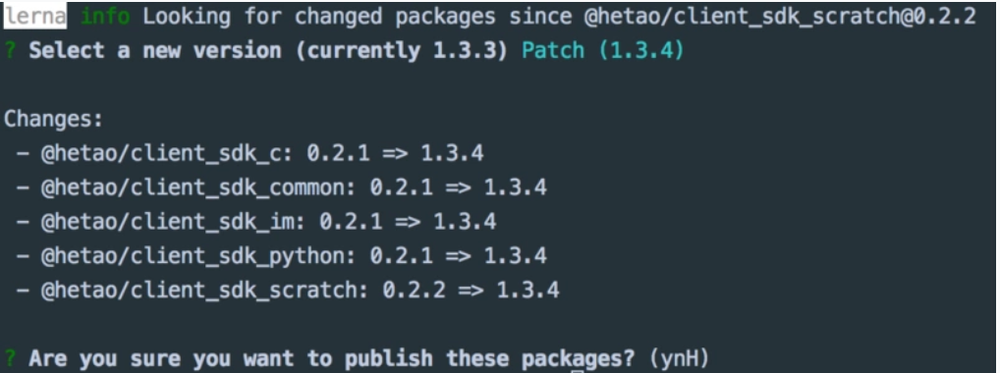
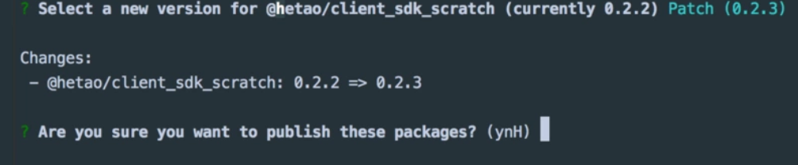

> 因为lerna在管理多个模块和项目时(发布版本，更新版本，集成工具)操作简单。不用自己手动管理互相依赖的版本问题。

## 提前思考：

### 独立的功能一定要拆分成独立的repo吗？
最近做直播还听说后端同事在管理每个模块时，他们都是一个模块一个仓库管理，我说为什么时，他回答说，可以防止别人胡乱提交...

### 除了一些内部的sdk或者带有自更新的应用，我们是不是很少关注项目的版本？有没有特殊的场景？
如果我现在有五六个项目，每个项目都有固定版本的相互依赖，比如经常见的 common, core，这些都是对通用和核心模块的解耦，我们简称基础模块。除了他们之外，还可能有一些偏业务的模块和关联性强的项目，这其中的项目和模块都引用了基础模块。
看起来只是分了几个文件夹相互引用嘛，但我们还是会面临一个工程问题，那就是，这些包是捆绑和固定式的更新，每次提交代码我都必须保证我们不得不关注这些包之间**版本问题**。
比如，我在common模块中的有很多util，隔了几天我发现了这里面util中有一个bug，然后我需要更新他，这时，


## 项目管理的方式

### mutipleRepos(多仓库管理)
就像我刚才说的我们后端一样，把每个业务模块抽离到单独的仓库中。

优点：

1. 可以为每个模块单独为开发者分配repo权限。其实，这个也不算优点，对于公司项目来说，很少有这种需求，第一团队内的开发人员还是很自觉的，第二，maintainer在合分支时就可以丢弃掉某个提交。
2. 模块的职责更清晰，复用程度更高，更明显。通常体现在跨语言的场景。

缺点有：
1. 项目管理，协同开发难。一个repo一个仓库，每个仓库都得clone。而且在ide中，通常你需要打开很多你想编辑的项目工程的窗口，如果是一个大的根目录的话，会indexing很久(这个也是可以在ide里配置的，但配置这个对于其他同事来说也是个成本)。
3. changelog 不好整理
4. 维护成本高。很多repo了之后，改一次就得提交一次git，试想一下，如果同时修改十几个repo，然后每个都test|lint，更新版本，提交，推送...

### monoRepo(单仓库管理)

lerna 使用的就是这个管理方式。

优点：
1. one repo with multiple packages，代码变更都能比较好清晰的体现给协同开发者
2. 子模块的版本版本变更会自动同步给相关的模块。
3. 多个模块的变动，可以融为一个提交。

缺点：
1. 一个repo的代码量变多了，其他开发者容易产生误操作，影响了其他模块。

## 使用 Lerna 

** Lerna ** 是一个monoRepo的项目管理工具，通过它，我们可以让发布安装和模块间的版本管理非常简单。

### Fixed/Locked mode(default)
使用 `lerna init` 默认创建固定版本模式，它会在lerna.json中的version中指定一个初始版本，
以后每次发布每个package中都会以这个版本为准，也就是说，这个版本代表了所有的pacakge的版本，
它们不能有自己独立的版本。



如图，`lerna.json` 中的版本是1.3.4，当发布时，把原有0.2.1的版本置为了1.3.4，而且是全量发布。

### Independent mode
使用 `lerna init -indenpendent` 初始化一个独立版本的lerna项目，它们各有独自的版本。比如我只更改其中一个包，那就单独更新这一个包，不会对其他包更新。检测有哪些包更新的功能是Lerna是通过commit文件的变动做的，也可以在lerna.json中的配置忽略更新的文件(command.publish.ignoreChanges = ["*.md"])。



这种模式比较常用，因为通常我们希望每个包都可以对外单独使用，单独维护，单独更新。

### commands
 #### create
 创建一个
 #### bootstrap
 #### publish
 #### version
 #### exec
 #### init
 #### add
    1.为某个包安装第三方依赖 ```lerna add xxx --scope=xxxx``` 
    2.为某个包安装本地依赖，如packages/a依赖packages/b```lerna add b --scope=a```
    3.为所有包安装依赖 ```lerna add xxx ```
 #### clean
 #### link
