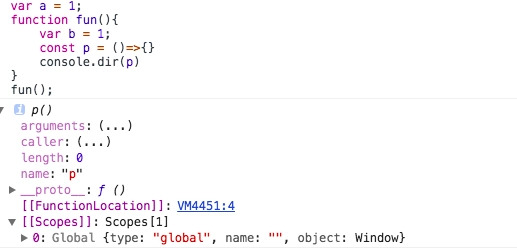
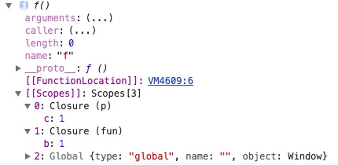
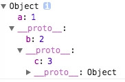

>内部属性在我们了解对象原型及环境变量时都有遇到过，可是毕竟看不到摸不着，很难更加深入的了解它的工作流程和作用,最近在chrome当中查看对象结构时，看到了释放出来的一些内部属性，这些以前大概都是概念，那么既然能看到，就让我们来探索一下吧~

<br /> 

## [[Scopes]]
此属性储存在函数对象中，我记得从chrome 62开始我就发现这个属性了，具体哪个版本大家可以google,现在我们把它给打印出来看一下.


这是一个不访问外部变量的函数，所以Scopes中只储存了Global全局对象。

还记得作用域链吗(如果不记得，请点击<a href='https://segmentfault.com/a/1190000009886713'>这里</a>看前半部分)？
从前往后分别是 [函数自己的变量对象，.., .., Global] 类似于这样依次向后(上)查找这个执行环境所`使用到`的变量对象。

在上面的文章说过，javascript在开始执行时，会经过两个阶段，预编译->代码执行，在v8中代码执行阶段运行的是`机器码`，CPU可以直接接收，
可以说，在javascript代码执行前都会经过复杂的代码分割，生成抽象语法树(AST)，编译解析与优化等操作，[[Scopes]]正是这其中的产物。下面说
下它形成的流程。

1. 词法阶段会定义函数所用到的变量，加入到[[Scopes]]内部属性当中，它是一个数组，最后一位`永远都是`Global全局对象，向前依次是祖先->父级。注意，这时只是在第一个阶段，js引擎并没有执行你的操作。(总之所有的脏活累活都要在第一个阶段完成，以保证js引擎执行的最高效率)

2. 执行流进入，读取这个`执行环境`(函数)的[[Scopes]]属性，并把自身的变量对象加入到前端(unshift)，形成`作用域链`，这样从头到尾的变量对象，构成了伟大的作用域。

需要注意的是，并不是所有的父级作用域的变量都进行存储，而只会存储当前函数所使用到的变量。所以我们进行这样的操作是查看不到父级变量的.

```javascript
  var a = 1;
  function fun(){
      var b = 1;
      const p = ()=>{}
      console.dir(p)
  }
  fun();
```





函数p当中并没用使用到父级函数中的变量b，所以[[Scopes]]只有Global对象(注意，因为Global对象永远存在，并且是引用，所以不会出现这种情况)，
我认为这也是一种优化手段，可以极大减少内存的使用。

我们换种写法：

```javascript
var a = 1;
  function fun(){
      var b = 1;
      const p = ()=>{
        var c = 1;
        const f = ()=>{ console.log(b,c) }
        console.dir(f)
      }
      p();
  }
  fun();
```




我们引用了父级作用域中的变量，并打印出来，在编译阶段，编译器把他们加入到了[[Scopes]]中。

此属性，我们不可去访问与修改它，目前只能在控制台中点击查看.

## [[FunctionLocation]]

这个很容易理解，类似于debugger功能，可以很容易的查找到此函数的代码位置，比如我们以React为例，查看 React.Component函数位置.


可以看到，key右侧的可点击部分，表示函数在react-dom.min.js第34行，我们点进去查看，晕了，代码被混淆了...


对于这个属性，我们以后可以大大减少console的使用啦

## [[Prototype]]
> 遵循ECMAScript标准，someObject.[[Prototype]] 符号是用于指向 someObject的原型。从 ECMAScript 6 开始，[[Prototype]]
可以用Object.getPrototypeOf()和Object.setPrototypeOf()访问器来访问。这个等同于 JavaScript 的非标准但许多浏览器实现的属性
\__proto\__。我们经常使用Object.prototype.toString来判断对象类型，toString就是把当前的这个属性转换成字符串返回出去了.

这个内部属性，表示对象的原型链，类似与[[Scopes]]也是一个数组格式.

```
   var b = {a:1};
   function o(a){
     this.b = a;
   }
   o.prototype = { c:3; }
   b.__proto__ = new o(2);
   console.log(b.a,b.b,b.c); //1 2 3
```

此时原型链关系是这样的: 





貌似还有很多内部属性，一时想不起来(如果发现，以后会更新)，大家有知道的，可以发表评论。
