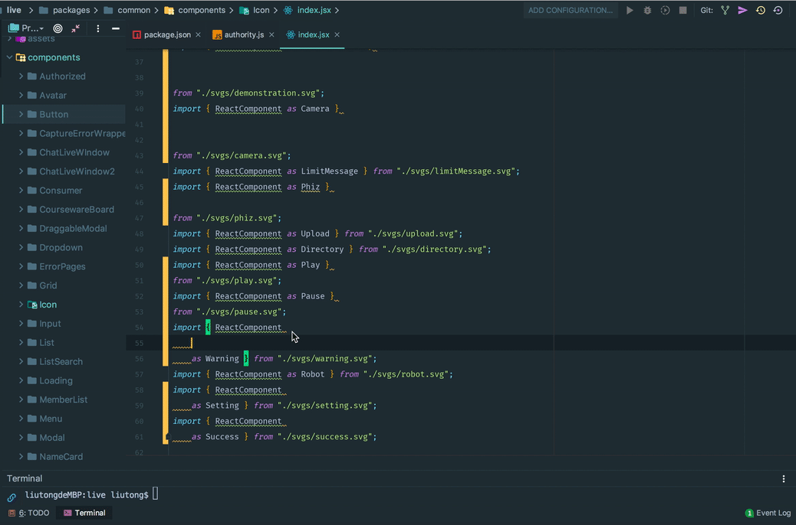
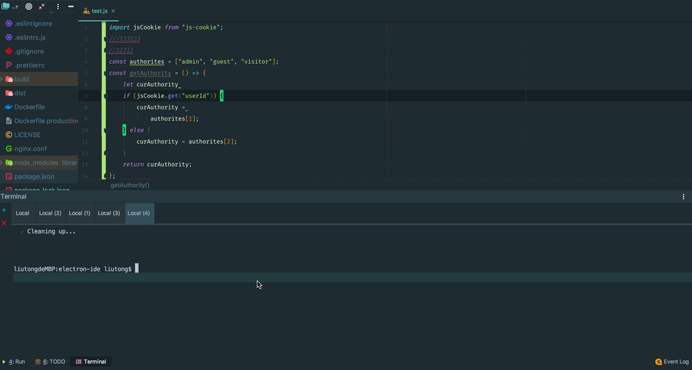
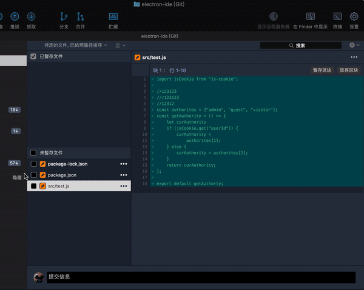
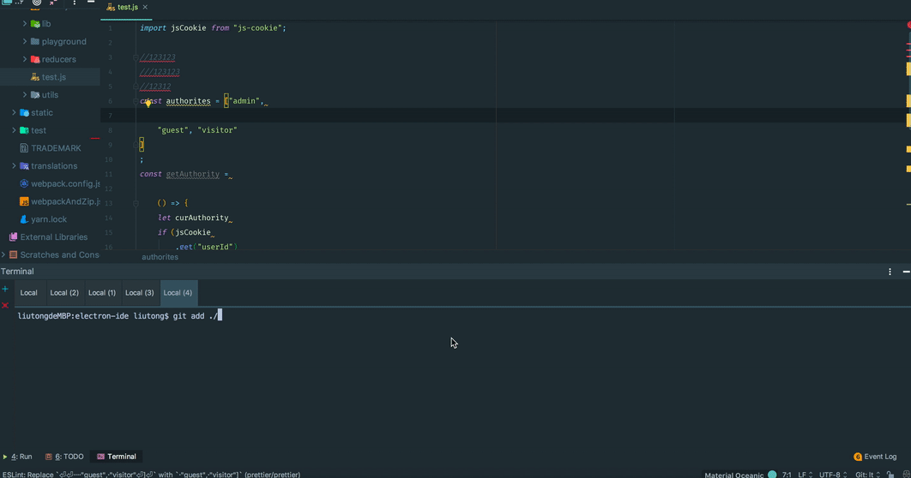

## 为什么需要统一格式和规则

---

### 格式

由于团队协作中各个开发者的编辑器，显示器不一样等等问题，导致在书写JS这种对空格和分号等字符不敏感的语言时格式上
偏离比较大，从而不适用各个成员的阅读习惯，这是一个浪费时间的问题。同时也不能避免一些糟糕的让人眼花缭乱的代码，
虽然一部分是使用形式上导致的，但有一部分取决于代码本身的书写格式。

所以，对于代码格式，解决的最重要的事情就是团队中的每一个人都有同一种阅读习惯，为阅读他人代码节省时间，提高效率，
甚至，从`精神`上可以让开发者们爱上他们的代码，**因为好看的东西总会被珍惜，丑陋的东西只会任人抛弃，越踩越烂。**

### 规则

规则是对代码质量的浅层校验，通过它可以限制一些基本的使用方式，去避免发生一些低级错误。其次也可以统一项目代码规范。

## 解决方案

--- 

### prettier
[`Prettier`](https://prettier.io/docs/en/cli.html) 是美化前端代码的工具，目前支持多种格式，`vue`， `html`, `jsx`, `ts`, `js`, `css`, `less`, 等等，
它可以解决上面说的代码格式问题，使用一套`格式规则`去格式化你的代码，下面是格式前后的对比。



上图是我把它的格式`破坏`之后，使用集成在编辑器中修复它，当然也可以通过命令式去检测或整理它。所以，给我的感受是**代码好像整容了**😺,
如果初次使用prettier工具的可能会对代码对安全性产生疑问，这样做会不会对代码的逻辑作出修改，
我使用prettier半年多了，目前还没有碰到过这种情况，像`eslint --fix`一样，它只会做一些格式上的补充，
不会舍弃或添加多余的代码，这也是npm的周下载量在八百万次的原因。

### eslint
`eslint` 就是一个很好用的规则检测工具，有非常强大的规则和插件库。但是很多项目因为时间等问题会使用`ignore`忽略代码，
甚至是慢慢的就抛弃掉`eslint`了，因为每次写完之后都是几十个错误，需要挨个去修改，太耽误时间。

出现这种情况多数是规则不符合个别人的习惯，比如有个规则是React的props名字需要按照字母表的顺序自上而下😭，
这符合部分人，但一般人没这个概念，这就需要在lint规则之前达成一个共识，但不能不使用。

一般lint检测会在部署阶段做，如果失败就不进行build。这么做有一些麻烦，因为有时会忘记在提交之前进行lint，
这种就得再提交一次，作为前者的lint修复。所以我们把它放到本地，简单了很多。

### husky
[`husky`](https://github.com/typicode/husky)是一个npm包，它通过`script`中的`install`钩子脚本
，在你安装这个包的时候，会向你的 `.git` 隐藏目录添加钩子脚本。

在 `.git` 中我们可以添加很多钩子，比如，`pre-commit`, `pre-push` 等等，
它也正是运用这种方法，在我们提交代码时给我们一个时机去运行我们自己的脚本。

那么现在我们就可以在`husky`提供的钩子上添加我们的 `eslint --check --ext js,jsx` 的命令，
每次提交之前都跑一次`lint`看是否有没有不合规的代码😄。那么，问题来了，如果是一个大型项目，
跑一次几乎要花费十几分钟的时间，这个太低效，也太可怕了，怎么办呢？

### lint-staged
[`lint-staged`](https://github.com/okonet/lint-staged)和husky没有任何关系，它们属于合作者，
lint-staged只是作为一个`eslint`的**调用者**，做的是只lint我们提交的文件，不用过多的去检测整个项目的文件。
然而，我们可以把它添加到`husky`的钩子中，从而达到每次提交只检测提交的文件的效果。

另外对于之前舍弃eslint的项目，可能无法一时就全部都把lint修复好，`lint-staged`也是一个不错的选择，因为随着每改动一个文件，
都会去把之前遗留在这个文件上的lint规则修复后才能提交，平分很大的修复工作量。



如图，我添加了一个 `//` 后面必须有空格的lint, 并且把`prettier`集成到`eslint`中，当我在提交它的时候，
告知我是未通过检测的，3个错误，2个提醒(`prettier`检测出来的问题作为提醒)，三个错误是三行的注释，
所以，不能提交代码。

对于使用`Sourcetree`等GUI的git管理工具来说，其结果也是一样的。

<p class="text-center">
  
</p>

### 结合体

以下是`pacakge.json`的配置片段，我们在`husky`中运行`lint-staged`命令，
它去调用`prettier`脚本自动修复繁枝错节的代码格式，然后再去`lint`我们提交的文件(注意不是提交的代码片段)。😺

```json
{
  "husky": {
    "hooks": {
      "pre-commit": "lint-staged"
    }
  },
  "lint-staged": {
    "**/*.{js,jsx}": [
      "prettier --write",
      "eslint"
    ]
  }
}
```

匹配所有暂存文件中的`js, jsx`文件，对他们运行`prettier`和`eslint`，对于prettier，是自动修复，
而eslint，只做提醒，修复考虑到可能有其他副作用，需要手动执行。以下是最终效果图。



上图提交代码时，自动修复代码格式，并提示有lint错误，不能提交，之后手动同步了一下文件(更新美化了之后的), 然后手动把lint错误去除后，提交成功。

## 总结

给代码做了美化和规则化只是让代码更稳定，易维护的第一步，他们做不了像ts那样对语言做强类型校验，让我们更多的思考接口设计中，
但可以提供最基本的策略和格式去避免小错误的发生，人越多的项目，它的好处就越明显。

😔实践过程中踩了一些坑， lint-staged逗比的作者(我估计因为肺炎正在家没事干呢)为了解决一个windows权限问题把版本弄到了10.\*，之后mac又出权限问题了，
还是把版本回退到了9.\*，这样保险。
