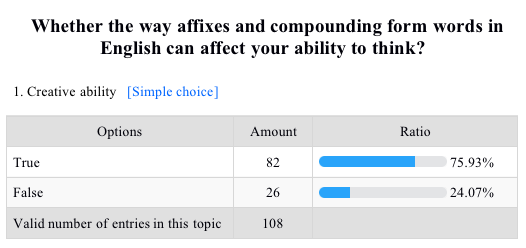
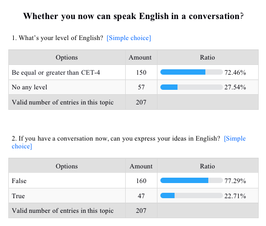

# A Study of Influences of English Learning On Teen’s Ability of Thinking

## I.Introduction

With the popularization of English in teenagers' education for many years, more and more people have begun to pay attention to the influence of the English language on teenagers' thinking ability. Every language has its own culture, unique charm, and logical structure. For a language, it is used every day in people and was deeply stamped in mind, as you can blurt out, and a great way to expand the mental model for teenagers whose brain tissue is developing. If it has formed a particular mode of thinking, there will be a complementary role and increase of language ability. Besides, thinking ability belongs to meta-ability, which can be applied to any field to increase the diversity of thinking, such as creative and critical thinking.

### A. Research background

In the past, discussions about English learning and the development of thinking ability are not uncommon. In the field of education, a popular topic is how to cultivate teenagers' thinking ability in classrooms—typically arousing many concerns about facilitating students' critical and creative thinking ability. Some studies have explored how to develop students' thinking skills in practical language activities such as English speech and debate[
. Liao Liqin(廖丽琴). Yingyu Yanjiang Yu Bianlun Zhong Pipanxing Siwei Nengli DePeiyang Yanjiu英语演讲与辩论中批判性思维能力的培养研究 (The Cultivation of Critical thinking ability in English speech and debate) (Beijing: Caizhi, 2018) 36.]. In a like manner, several research introduced how to develop students' thinking skills through classroom discussion activities and games[. Wang Yuzhen(王玉真). Zai Yingyu Jiaoxue Zhong Peiyang Xuesheng De Chuangzaoxing Siwei Nengli在英语教学中培养学生的创新思维能力 (Cultivating students' creative thinking ability in English teaching) (Beijing: Xueyuan Education, 2015) 19.]. These discussions mainly explore how to promote the development of students' thinking ability in English teaching from the perspective of English learning content, e.g., analysis and discussion of reading materials, learning activities, e.g., group discussion and debate, classroom teaching methods, and so on.

### B. Research motivation and objective

At present, the revised High school English curriculum standards by the Ministry of Education of the People's Republic of China in 2020[ MOE(中华人民共和国教育部). Putong GaoZhong Yingyu Kecheng Biaozhun普通高中英语课程标准 (General High school English curriculum standards) (Beijing: People's Education Press, 2020) 4.] clearly list thinking quality as one of the core elements of English students. However, it is not easy to achieve this curriculum goal. The relationship between language and thinking is very complicated for Chinese students who speak English as a foreign language. The relationship between native language thinking ability and English thinking ability is more difficult to explain clearly.
This study focuses on the impact of English learning on innovation and critical thinking, proposes the problems that affect the development of teenagers' thinking ability under the current educational environment, and provides corresponding strategies The purpose is to change the current English education environment, not for the purpose of taking exams, improve the importance of thinking training, which will change the logical thinking of young English learners, make it more in line with the Language thinking of English, make it useful for life

## II.What’s thinking ability of teenagers?

Essentially, English learning is part of language learning, which is closely related to thinking. To some extent, language is a tool of thinking, which is one of the basic capabilities of teenagers. It refers to the ability to understand things comprehensively and deeply through brain analysis, synthesis, judgment, and reasoning. In addition, it includes the capacity to ask questions, analysis, imagination, and comprehensive ability. Youth is a golden age in the development of thinking ability, I will account for these points in three parts below.

### A. Principles of thinking ability

#### 1. Thinking is the indirect and generalized processing of real things by the human brain

The thinking seems mysterious, out of sight, out of touch, but it really exists. Just as the famous scientific forum gave an article, which indicates that thinking ability is the indirect and generalized processing of real things by the human brain and refers to the ability of people to have a comprehensive and in-depth understanding of things through the brain analysis, synthesis, judgment, and reasoning. As a result, thinking ability could influence the actions of a people.

### B.Significance of thinking ability for teenagers

#### 1. Adolescence is a special stage that can absorb more external influences

Teen is a particular growth stage that represents the progress from a boy or girl into adulthood. Generally, this word describes the stage of age in 14 - 19. In this stage, they bring many changes. These are not only physical but also mental and social changes. During these years, teens become more able to think abstractly. Over time they can make plans and set long-term goals. Each one may progress at a different rate and may have a different view of the world. For this reason, thinking ability is a significant stage for teenagers. But in the real world, whether society, exams, and the incoming job for these teens, one of the most important things are to get rid of difficulty by resolving some problems. So, what does the thinking ability affect resolving issues?

#### 2. The ability to think has a big impact on the ability to solve problems

When it comes to problem-solving, decision-making was a critical event for better results and solutions. In a study authored by Dr. Haresh Kumar Kantilal[. Haresh Kumar Kantilal. Thinking Skills and Problem Solving (Malaysian: Meteor Doc, 2011) 3.], who engaged in microbiology for many years, showed the thinking ability plays a vital role in the stage of making decisions. This stage is also an essential function of resolving problems.

#### 3. Thinking ability has a big impact on grades

Some pragmatists would say that the above viewpoint is far away for teens, which only need to study in school. But there is a short-term thing. Exam, which teens usually met from primary school into the university. So what does it affects exams? Liu Resheng, Master of Applied Psychology, Liaoning Normal University, Dynamic communication tutor in Chinese Academy of Sciences, in his textbook[. Liu Resheng(刘热生). Xuexi De Benzhi学习的本质 (The Nature of Learning) (Beijing: Machinery Industry Press, 2019) 25.], indicated the importance of thinking patterns for improving scores. So what did the thinking patterns mean? Below I will explain three kinds of thinking abilities.

### C.Definition of many kinds of thinking ability

#### 1. Illumination of critical thinking ability

At first, critical thinking ability is the ability to measure situations and derive accurate decisions. Based on the findings of a study[. A & Zarei, Nafiseh. The Impact of Critical Thinking on Learning English Language (Malaysia: UNITAR International University, 2018) 3.], it performed critical thinking was used for constructing knowledge, which refers to the ability of individuals to take charge of their thinking and develop appropriate criteria and standards for analyzing their thinking. The characteristic of critical thinking lies in the careful analysis and judgment of ideas and beliefs. By rejecting inappropriate ideas, we can get closer to the truth and truth and avoid the regret caused by improper decisions caused by wrong cognition. The main purpose of critical thinking is to obtain the most rational and objective judgment as possible. On the other hand, it also helps us to establish a rigorous and solid reasoning structure, which is easier for others to understand and identify.

#### 2. Illumination of creative thinking ability

Secondly, creative thinking ability means thinking outside the box. Often, creativity involves lateral thinking, which is the ability to perceive patterns that are not obvious. Creative thinking might mean devising new ways to carry out tasks, solve problems, and meet challenges. It means bringing a fresh, and sometimes unorthodox, perspective to some things. This way of thinking could help teens to be more productive. It is easy to get stuck in the same thought patterns, especially at work. However, those thought patterns may be hampering your innovation and keeping you stuck in routines that do not serve you. Creative thinking shows us many solutions to any problem, and developing your creative thinking skills helps you recognize innovative solutions more quickly. Moreover, according to a LinkedIn study[. Paul Petrone. The Skills Companies Need Most in 2019 – And How to Learn Them (Sunnyvale: Linked-in blog, 2018) 1.], creativity was soft skill employers were looking for most job candidates in 2019, it ranks second among hard and soft skills, so strengthening creativity skills can set teens apart at work.

## III.Influences of English for thinking ability

Even if thinking ability is very important for teenagers, what is the influence of English as a subject that Chinese teenagers learn for a long time? Next, I will introduce it from three aspects.

### A.Grammatical structure

#### 1. Future tense grammar of English have a significant influence on teenagers

Take Chinese as an example. The most significant difference from Chinese in grammatical structure is the change of tense. The English language has the function of tenses intrinsically, such as future, past, present, and so on, while Chinese has no concept of tense in grammatical structure. Further, from the aspect of linguistics, language can be divided into strong FTR and weak FTR. Languages with strong future tenses (e.g., English) use different grammatical tenses for present and future events (e.g., it will rain tomorrow); Languages expressed in the weak future tense, such as German and Chinese, Both the two languages have no distinction between present and future grammatical tenses. For Instance, in Chinese describe the above sentence, it will be "明天下雨." means "it rains tomorrow.". You will mention there are no tenses of the verb "will.". In a 2015 academic paper[. Neil A Lewis Jr, Daphna Oyserman. When does the future begin? Time metrics matter, connecting present and future selves (New York: SAGE Publications, 2015) 816-825.], authored by Oyserman and Neil Lewis, an assistant professor, worked at Cornell University, found that strong future tense statements made people cognitively separate the present from the future. It makes the future feel even more distant. And use strong future expressed than those who use weak future more future-oriented expression language, think the connection between now and the future is interlinked. Still, they are now the behavior would be a more significant impact on the future so that they will be more focused on the future, including deposits, exercise, quitting smoking, retirement, and maintaining long-term health. Therefore, the future tense grammar of English will have a significant influence on teenagers.

#### 2. Widespread use of passive voice in English can make people think more objectively after using this grammar for a long time

Moreover, compared with Chinese, widespread use of passive voice in English can make people think more objectively after using this grammar for a long time. The passive voice seems to be more objective. For example, "he has been cut with a knife." and "I cut him with a knife." are very different. The former does not have the person that acts the behavior. So the listener would more like to pay attention to the action, not the subject. It will not get into a habit of centering oneself. However, if you are Chinese, you may say that I also can use the former sentence to express the same words using Chinese. It is not incorrect totally, but in the Chinese language, some scenarios can not speak using "being.". For example, "He was born." is a sentence of passive voice, but in Chinese, we cannot say "他被生了" as this is so confusing, just like this kind of feature of some languages, made the preference of passive voice. Therefore, in this different language habit, if you are familiar with the Passive voice of English, you will shape a non-subjective impression of thinking, which makes the speaker pay attention to the predicate and object.

#### 3. Adverbials and attributive clauses in English could help teens to form an abstract thinking

English has adverbials and attributive clauses, characteristic grammars, which usually split complex expressions into multiple parts described separately. In contrast, the Chinese put them together, making it easy to create a solid-state of mind. For example, there has a sentence we are trying to test, the Chinese version is "这个理论是指导中国人民胜利实现社会主义现代化的科学理论," translating to English directly, it is "This theory is the scientific theory guiding the Chinese people to achieve socialist modernization successfully.". But it is not quite officially a manner of English, especially in writing. Generally, another version is usually used: "The theory is the scientific theory which directs the Chinese to fulfill the modernization of socialism." In this version, the word "which" describes its previous subject, the scientific theory. By comparison, we can see this grammar has a hierarchical structure. For this reason, it could help teens to form an abstract mode of thinking.

### B.Lexical aspect

#### 1. English vocabulary has a lot of creativity

In English, affixation is one of the most productive ways to derive new words: No matter what the word is, you can almost always add an affix to derive a new, related word from it. Another extremely productive way of deriving new words in English is by compounding, that is, by taking two existing words, both of which are free morphemes, and sticking them together. For example, chairman, motherland, classroom, and so on. All these words are examples of the generativity of grammar. The language is constantly adding new words, using the productive morphological processes that are part of the grammar.
In contrast, the concept of new words does not exist in Chinese, which usually generates some new combinations in existing words to express a new meaning like the Japanese. Compared to these languages, English vocabulary has a lot of creativity, so does the long-term use of English impact individual creative thinking? Provided that you are a teenager, that is to say, your mind is in the process of being formed. How do you think about this? There may not be a convincing conclusion here because no articles or internet investigations are looking at this. Hence, I published a questionnaire survey in Chinese society, and the results are as follows. Let's see as below .

  

As the above result showed for the survey, more than 75 percent of the 107 people thought this way of constructing English words could improve their creativity in real life. So affixation could enhance the creativity of thinking ability, at least for Chinese.

### C.Cultures in English

Language is not just a way to communicate; it is a component of culture that makes it unique and specific. When language and culture are discussed, the phrase "language is culture and culture is language" is often mentioned because the two are always intertwined. It means that the language you speak reflects what your values and beliefs are. Below, let's take a look at these effects.
Thinking modes and language are interrelated and influence each other. A country or a region in the process of historical development can form different ways of thinking, cultural characteristics and slowly produce that belong to their own language and culture. Similarly, The different ways of thinking caused the development of the various elements in the other aspects of culture. It is also one of the main reasons for cultural differences. Through different languages, embodies the essence of the thinking and culture of each region.

#### 1. God culture could form the critical thinking.

As we all know, language is a bridge of communication and the soul of national culture. So far, there have been 110 countries is in the use of English, among which used as an official language in 45 countries. Besides, with the acceleration of globalization, English has become the most influential language in the world. According to a research[. Ethnologue. The Most Spoken Languages Worldwide in 2021 (by Speakers in Millions) (Statista, Statista Inc, 2021) 1.], In 2021, there were around 1.35 billion people worldwide who spoke English either natively or as a second language, roughly 20% of the global population. As you can see, it plays an essential role in world culture. So what does culture do to our thinking? Please see the cases given below.
Despite the cultural ubiquity of ideas and images related to God, there have slight differences in English. For Instance, as the representative of western languages, usually says: "oh, my God," when extolling something or being surprised. There may be no concept of "god." for Chinese people. If they want to understand it, they need to understand this part of western culture and the idea that God exists in Greek and Roman civilizations. So, What do Chinese people's thinking ability changes after the thinking is affected by that God culture? A study authored by Laurin, Kristin[. Kristin Laurin, Aaron C Kay, Gráinne M Fitzsimons. Divergent effects of activating thoughts of God on self-regulation (Columbia: American Psychological Association, 2012) 1-4.], showed that the God culture could affect thinking improving self-regulation. In that principles, people would like to inspect some things they made decisions before like a God. Over time, they will get into the habit of that thinking mode. Generally, we call this thinking ability as critical thinking.

#### 2. Culture of straightforward express could enhance critical thinking model

In another aspect, English is straightforward than Chinese in modal particles, such as salutation. In Chinese, there are many calls, such as the brother and sister, which can express two relationships born by the same mother or by another forefather. For example, looking at the many idioms the Chinese culture has on family, you can definitely see how much they value that relationship. And in the English language, there is not so much, only my brother or sister. Therefore, speaking-English people would reduce the understanding of the relationship between people, focusing more on the subject's content rather than a pronoun. Which remarkably improves impers onality. It is crucial for critical thinking.

## IV.Problems in Thinking ability

In the second chapter above, I introduced the importance of teenagers' thinking ability. In the third chapter, I expounded on the influences of English on teenagers' thinking ability. So does it mean that learning English can improve teenagers' those two abilities? In fact, there have some obstacles. Take Chinese teenagers as an example; there are some problems in their way of learning, such as focusing on scores, neglecting oral communication, insufficient confidence, and without output which leads to low improving in students' thinking ability. It is embodied in the following aspects:

### A.Neglecting oral communication

Generally speaking, mastering a language tests whether you can communicate fluently face to face, rather than just reading and writing blindly. Of course, I do not deny the importance of reading and writing in the learning process. I have published a questionnaire in some chat groups of universities, which has two single questions in the paper. The first is "What is your level of English?"; corresponding options are "be equal or greater than CET-4", or no any levels. And the second question is, "Whether you now can speak English in a conversation?"

  

Above, the result of the survey may be a little unexpected. 72% of these students have the qualification of CET-4 for the first question, 77% people who have no confidence or no ability to speak English in the second question. Can you believe a Chinese student has passed CET-4 but cannot communicate using English? Therefore, oral communication is a weakness for Chinese students. But, what connections between oral communication and creativity? A study showed that verbal communication is an efficient way of learning English in the classroom[. David Kluge. Creativity and Performance in Education Applied to an Oral Communication Class (New York: Chukyo English Linguistics, 2018) 2.
], which can enhance the creativity of students. Based on this, many English courses focus on explaining important sentence patterns and vocabulary in the text and combining the format of the text and writing skills for students to practice writing to improve students' English scores.
On the other hand, the modern teaching system prefers oriented examination. In this teaching model, students can enhance their English to a certain extent, but their English thinking is rigid; they have no self-confidence and practical experience in spoken English. Therefore, the influence of the thought of its English was significantly reduced. In contrast, when the brain is in the mode of autonomous language learning, thinkings will be affected, not the deliberately training "examination skills."

### B.Insufficient confidence

Although creativity is important, critical thinking is also considerable. The former relatively prefer the capacity to develop something, and the latter is more likely to resolve problems. However, teenagers are influenced by traditional English learning methods in China and generally adopt the "submissive learning method." They are accustomed to teachers' "speaking and giving" and lack of thirst for knowledge and spirit of exploration. Therefore, the ability to analyze and understand problems for teenagers is weak, and their English learning effect is poor. To sum up, "submissive learning" is the main problem in English learning. The development of students' way of thinking and thinking quality is greatly hindered, and their learning enthusiasm and active thinking consciousness have not been stimulated, which needs to be solved and perfected urgently.

### C.Only input not output

Input refers to the processable language (i.e. receptive skills) that learners are exposed to while listening or reading. Output, on the other hand, is the language they produce in speaking or writing (i.e., production skills). The input is multidimensional. It comes from teachers, textbooks and students themselves. It may also come from sources outside the classroom (TV, podcasts, social media, etc.). There is an interaction between input and output, between reception and production skills.

As the saying goes, to master a knowledge needs not only input, but output is more important. Anton Chekhov, a Russian playwright and short story writer, who was considered one of the greatest writers in the world. He once said, "Knowledge is of no value unless you put it into practice." So, only inputting knowledge and do not practice, it may forget after a few days. But if you give it out, like sharing it with others, writing every day, that's output. Especially language. But the problems is, that is the most insufficient things in the Chinese students.

## V.Strategies of Improving Teen’s thinking ability

Some problems are mentioned above, but if you want to solve them, a learner cannot change completely. So here are some countermeasures in education, hoping to inspire teachers and self-educated teenagers.

### A.Cultivate students’ good English Learning Habits

#### 1. Reciting plays a vital role in improving Teens' thinking ability

Professor Hu Chundong, a famous English teaching expert, once said, "The habit of language is gradually formed by imitation, and to imitate, we must read and recite.[. Hu Chundong(胡春洞). Yingyu Xuexifa英语学习法 (The way of Teaching English) (Beijing: Higher Education Press, 1990) 43.

#### 2. Silently translate in mind

A proverb in Chinese can be expressed in English like "if you stick on one thing continually, you can grind such a thick iron rod into a needle.", the principle can also apply in English learning. If you worry about wasting time by practicing intentionally, there has a convenient way to solve this problem. You can silently use translated English in the chat to form a bilingual switch, which can also increase the impression of the English language. So it will improve the creativity of thinking ability for teens.

## B.Cooperative and inquiry learning methods

The cooperative group learning activities can cultivate students' leadership consciousness, social skills, and democratic values, which are constructive for critical thinking ability. Schopenhauer, a German philosopher, said: "the thoughts recorded on paper are like the footprints left by someone on the sand. We may be able to see his path, but if we know what he sees on the road, we must use our own eyes." These words well express the important value of inquiry learning. Inquiry learning helps to develop students' excellent intellectual quality. For example, love and cherish learning opportunities, respect facts, treat critical thinking objectively and prudently, understand and humbly accept shortcomings, pay attention to good things, etc. Therefore, the core task of English teaching reform is to establish and form an independent, cooperative, and inquiry learning method aimed at fully mobilizing and giving full play to students' subjectivity. Here is a specific practices:

#### 1. Let students participate in the proposition
   The New Concept of Curriculum Standard requires teachers to have a correct view of students and respect and love students as equals. Teachers should be people-oriented, focus on student development, actively participate in the evaluation, and reflect the thought of equality and democracy. The practice has proved that the construction of an English classroom aims to cultivate the learning and teaching methods of innovative spirit, practical ability, develop students' scientific thinking quality, and good habits. Teachers encourage students to question textbooks and surpass teachers and appreciate personalized understanding and expression, which can open students' minds, stimulate memory, awaken potential, and effectively cultivate students' creative thinking ability. Only in this way can our English classroom be harmonious, vivid, and engaging, and our English teaching gets a real leap.

Only when teachers reflect on the prime position of students' learning and take effective methods to provide more help for students can they effectively improve the teaching quality and students' learning efficiency.

### C.Increase confidences of students

English teachers should make the English classroom full of laughter and laughter. They should not speak words that are detrimental to students' self-esteem, such as "Why are you so stupid! ", "You disappoint the teacher so much! ". Because these languages will not only stimulate students' young hearts, but also affect students' enthusiasm and interest in learning English. Besides, English teaching is the teaching and learning of students and teachers and the process of emotional communication between students and teachers. The relationship between teachers and students directly restricts students' emotions and will affect students' cognitive activities. The teacher should inject emotional vitality into the English classroom, respecting and encouraging students to enhance critical thinking. Besides, live in harmony with students with their own teaching enthusiasm and spiritual emotion. To practice in this way they cloud have a good English class, the method has proved that positioning the essence of teaching as communication is the best choice in the teaching process. Moreover, teachers need to grasp their own role and can no longer act as the arbiter of knowledge. They should change the tendency to overemphasize the teaching of knowledge and strive to form students' active learning attitudes.

## VI.Conclusion

Although there are some problems in most of the current English education environment, if the above countermeasures can be carefully implemented, it is not difficult to improve thinking ability. 
Which it belongs to Meta-ability, which plays a significant role in the cultivation of thinking in teenagers. The short-term effect may not be noticeable,
but the stick can change the outlook on life, values, and even the thinking ability, e.g., creative thinking, critical thinking. 
Whether in the home, school, or society, we should attach importance to cultivating the thinking ability of teenagers. 
English learning, whether in critical thinking, creative thinking, has an excellent constructive role. These mindsets take root from teenagers and stay with them throughout their lives, 
so the impact is highly profound. As a result, these patterns of thought take root from them and stay with them for the rest of their lives. Teenagers are exposed to a more excellent range of ideas that will help them generate creative solutions and new conclusions to their controversial problems. 
Thus, it shifts teenagers' way of thinking to a higher level and promotes better learning.

## Notes
1. Liao Liqin(廖丽琴). Yingyu Yanjiang Yu Bianlun Zhong Pipanxing Siwei Nengli DePeiyang Yanjiu英语演讲与辩论中批判性思维能力的培养研究 (The Cultivation of Critical thinking ability in English speech and debate) (Beijing: Caizhi, 2018) 36.
2. Wang Yuzhen(王玉真). Zai Yingyu Jiaoxue Zhong Peiyang Xuesheng De Chuangzaoxing Siwei Nengli在英语教学中培养学生的创新思维能力 (Cultivating students' creative thinking ability in English teaching) (Beijing: Xueyuan Education, 2015) 19.
3. MOE(中华人民共和国教育部). Putong GaoZhong Yingyu Kecheng Biaozhun普通高中英语课程标准 (General High school English curriculum standards) (Beijing: People's Education Press, 2020) 4.
4. Haresh Kumar Kantilal. Thinking Skills and Problem Solving (Malaysian: Meteor Doc, 2011) 3.
5. Liu Resheng(刘热生). Xuexi De Benzhi学习的本质 (The Nature of Learning) (Beijing: Machinery Industry Press, 2019) 25.
6. A & Zarei, Nafiseh. The Impact of Critical Thinking on Learning English Language (Malaysia: UNITAR International University, 2018) 3.
7. Paul Petrone. The Skills Companies Need Most in 2019 – And How to Learn Them (Sunnyvale: Linked-in blog, 2018) 1.
8. Neil A Lewis Jr, Daphna Oyserman. When does the future begin? Time metrics matter, connecting present and future selves (New York: SAGE Publications, 2015) 816-825.
9. Ethnologue. The Most Spoken Languages Worldwide in 2021 (by Speakers in Millions) (Statista, Statista Inc, 2021) 1.
10. Kristin Laurin, Aaron C Kay, Gráinne M Fitzsimons. Divergent effects of activating thoughts of God on self-regulation (Columbia: American Psychological Association, 2012) 1-4.
11. David Kluge. Creativity and Performance in Education Applied to an Oral Communication Class (New York: Chukyo English Linguistics, 2018) 2. 
12. Hu Chundong(胡春洞). Yingyu Xuexifa英语学习法 (The way of Teaching English) (Beijing: Higher Education Press, 1990) 43.

## Bibliography

- Carringer, Dennis C. Creative Thinking Abilities of Mexican Youth: The Relationship of Bilingualism. America: Journal of Cross-Cultural Psychology, 1974.
- Meng Xiangfang(孟祥芳), Sun Baoling(孙宝玲). Wuyi Tanjiuxing Jiaoxuefa Dui Fazhan Yingyu Hexin Suyang De Cujin Zuoyong 5E探究性教学法对发展英语核心素养的促进作用(The Role of 5E Inquiry Teaching Method in Promoting the Sevelopment of English Core Literacy). Tianjin: Journal of Tianjin Normal University, 2017.
- Showqi S. The Effects of Foreign Language Learning on Creativity. Mashhad: Ferdowsi University of Mashhad, 2012.
- SP Miao. The Influence of Critical Thinking Movement on General Education in the USA. Beijing: Tsinghua Journal of Education, 2007.
- Yule G. The Study of Language. Cambridge: Cambridge University Press, 2014.
- Zhao Xiaojiang(赵晓江). Yingyu Siwei Yu Yingyu Xuexi英语思维与英语学习(English thinking and English learning). Shenyang: Journal of Shenyang College of Education, 2000.
- Zhang Taigang(张泰刚). Yingyu Cihui JIaoxue zhong Peiyang Xuesheng Siwei Nengli De Juece英语词汇教学中培养学生思维能力的策略 (Strategies for Cultivating Students' Thinking Ability in English Vocabulary Teaching). Zhongshan: Educational Research Institute of Guangdong Province, 2014.
- Zhou Jianqiu(周俭秋). XiaoXue Yingyu Jiaoxue Zhong Peiyang Xuesheng
- Siwei Nengli De Celue小学英语教学中培养学生思维能力的策略 (Strategies for Cultivating Students' Thinking Ability in Primary School English Teaching), Zhongshan: Primary School of Zhongshan City, 2018.
