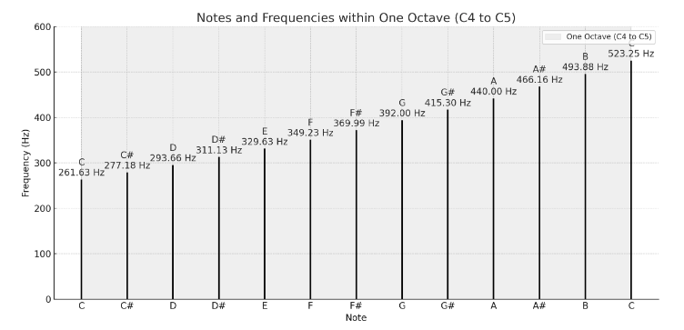

在了解12平均律之前，思考一下音乐是什么，音乐是物理世界中发出的一种声音，通过震动产生共鸣，有低沉浑厚的，有慷慨激昂的，也有触人心弦的刺耳音。每一种声音搭配出来的节奏，配合在一起都能表达出不同的意境。这就是纯音乐，如果再配合上人声，即是唱音 + 弹奏，形成一首歌曲。

单纯就纯音乐来说，构成的方法很有讲究。除了一些卡拍，音准等基操之外，如何组合音符形成跌宕起伏，音符之前的旋律延展到整首曲子，是否能够表达出原有的情感，这考验的其实是设计和抽象能力。最最最难的是，音乐是有灵魂的，不是一成不变的，所以单纯靠模版生拉硬套，其实很容易碰到瓶颈。

但是呢，如果想学到音乐中的灵魂，乐理基础是少不了的。物理发出的音符一共有多少种，它们是如何分类的。这就是 12分音符的作用。

发明12音体系的人虽然是个外国人，但实际中国古代箫，笛，琵琶等乐器也有研究过类似的理论，比较著名的就是明朝皇族世子，朱载堉。恰好不好和国外的12音阶 do re mi fa sol 类似。不得不感叹，原来世间万物正确的事都是共同的。

在说12分音符之前，先了解几个名词，音程，律制。

## 音程

顾名思义，音程就是两个音调之间的程度，或者距离。

这里有两个概念，`波长`指的是物理维度上对发出音符的方式，波长成1:2的比例音调基本一样，最终形成形成一个 `频率HZ`，只是音的高低不同。
所以这种成比例的音调，有一种常见的说法`和谐`，指的也就是音乐心理学上被认为是自然，顺耳的音。

所以把它们叫作八度。比如 do re mi fa sol la si do，第一个do是中音，第八个也是do，
但是这个do是升音#do，它们都发do的音，只是比较和谐的同音。(很神奇，一个八度的组成正好是一个圈)

一个八度可以代表的是什么呢？一个八度就像是一把圈尺，你把尺子放在哪个起始位置，最后效果就不一样。他并不是一个固定的音，
而是音程关系，针对音阶的衡量方式。取决于 offset。

而上面举例说明的do,re,mi,fa... 这些都是`唱名`， 通过唱名人声基本可以模拟对应的音符，这就是唱名的作用，可以认为是人声关联音符的方法之一吧，比如你听一首曲子不错，但是
手头又没有谱子，就可以通过音调推到出唱名，一首伴奏就能弹出来。

但是呢，唱名只能代表一个比较`宽泛`的发音，比较适合吉他弹唱，和声这类的弹奏。但专业一点的，比如音乐会的乐器演奏，乐谱阅读什么的基本都以`音名`为准。

举个栗子：

```
C大调音阶：

唱名（首调）：Do, Re, Mi, Fa, Sol, La, Ti(Si), Do
音名：C, D, E, F, G, A, B, C


G大调音阶：

唱名（首调）：Do, Re, Mi, Fa, Sol, La, Ti(Si), Do
音名：G, A, B, C, D, E, F#, G
```

上面C大自然调的音名是 CDEFGABC，和G大调不同，但是唱名却看不出区别。这就是粗旷和专业的区别，hhhh。

所以我还是专业一点😳，下面以音名为准。。。

可以看到，上面举例的两个音名，不管是C大调，还是G大调，它们第一个音和最后一个音都是一样的，也就是一个八度。

这里边每一度都代表着一个全音，每个全音之间相差`1`, 所以这是八个全音。

但是每个全音之间呢，又隔了一个半音，每个半音之间的关系是0.5. What? 那不就成了15个音了？没错如果每个全音之间就真的隔一个半音的话确实，
但 E -> F, B -> C 之间并没有半音。。。 **所以就少两个了，变成了13个音符，但中间隔了12个半音(最后一个C不算)**。

<p class="text-center">
  
</p>

可以看到，上图中EF，BC中间没有半音。所以加起来一共12个音，12分音符/平均律 也是这么等分的。上面的竖轴Frequency，
可以理解为每个音名的弦(比如小提琴，钢琴，吉他)震动频率，震动的频率越高，声音越细腻音色越高。


## 调性

```
例子 1: C大调（C Major）
C大调的音阶：C, D, E, F, G, A, B
对应的和弦：
C Major (I): C
D Minor (ii): Dm
E Minor (iii): Em
F Major (IV): F
G Major (V): G
A Minor (vi): Am
B Diminished (vii°): Bdim


例子 2: G大调（G Major）
G大调的音阶：G, A, B, C, D, E, F#
对应的和弦：
G Major (I): G
A Minor (ii): Am
B Minor (iii): Bm
C Major (IV): C
D Major (V): D
E Minor (vi): Em
F# Diminished (vii°): F#dim


例子 3: D大调（D Major）
D大调的音阶：D, E, F#, G, A, B, C#
对应的和弦：
D Major (I): D
E Minor (ii): Em
F# Minor (iii): F#m
G Major (IV): G
A Major (V): A
B Minor (vi): Bm
C# Diminished (vii°): C#dim
```

上面说音程是一把尺子，他的的起始位和终点不是固定的，起始位的不同可以组合出不同的音节。在真实弹奏中，常常是几个大调混合组成的。

比如：

```
贝多芬的《悲怆奏鸣曲》（Sonata Pathétique）
贝多芬的《钢琴奏鸣曲第8号》（Op. 13），通常被称为《悲怆奏鸣曲》，展示了调性变化的复杂性。

第一乐章（C小调）
主题：作品开始于C小调，传达了一种戏剧性和悲壮的情感。
调性变化：在发展部（development section），音乐通过多个调性变化，增加了戏剧性和情感深度。

第二乐章（A大调）
主题：第二乐章转为A大调，带来一种宁静和抒情的感觉，与第一乐章形成鲜明对比。
调性变化：即使在A大调中，乐章也会暂时转向其他大调和小调，增加音乐的丰富性。

第三乐章（C小调）
主题：最后乐章回到C小调，恢复了作品的戏剧性和紧张感。
调性变化：乐章中包含多个调性变化，使得音乐更加动态和引人入胜
```

在吉他的弹奏中，由不同的大调构成了不同的和弦。 C，G，A，Am，Em等等大小调，通过切换和弦可以弹奏，这也是一种变调。

下面是C大调中的七个和弦。

```
C大和弦（C Major）：C - E - G

符号：C
类型：大三和弦
D小和弦（D Minor）：D - F - A

符号：Dm
类型：小三和弦
E小和弦（E Minor）：E - G - B

符号：Em
类型：小三和弦
F大和弦（F Major）：F - A - C

符号：F
类型：大三和弦
G大和弦（G Major）：G - B - D

符号：G
类型：大三和弦
A小和弦（A Minor）：A - C - E

符号：Am
类型：小三和弦
B减和弦（B Diminished）：B - D - F

符号：Bdim
类型：减三和弦
```