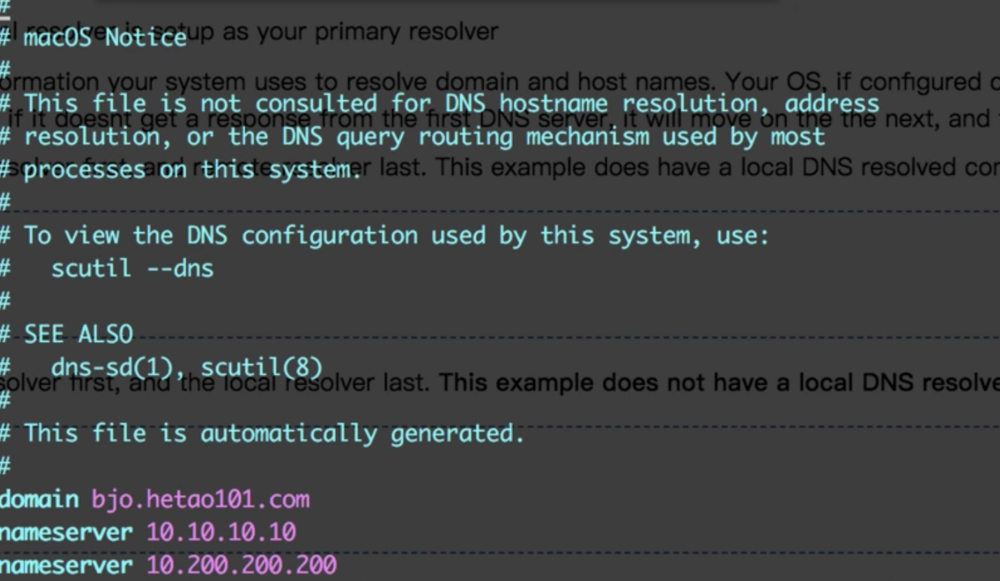
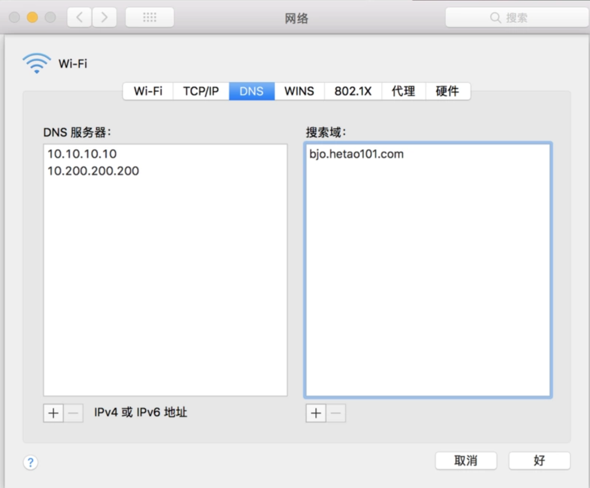
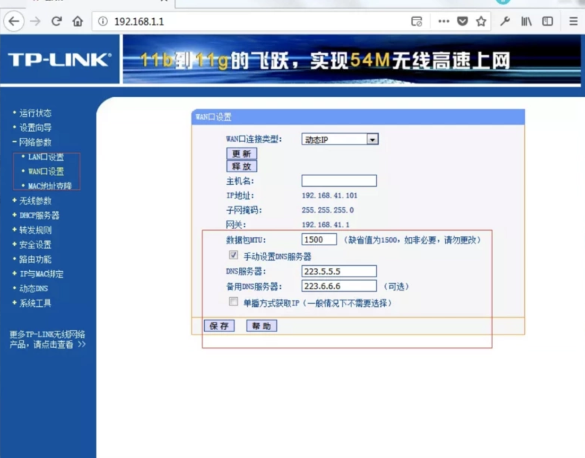
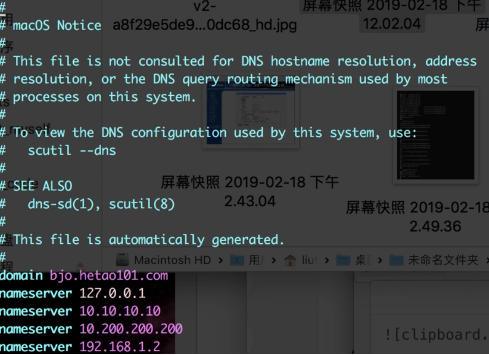
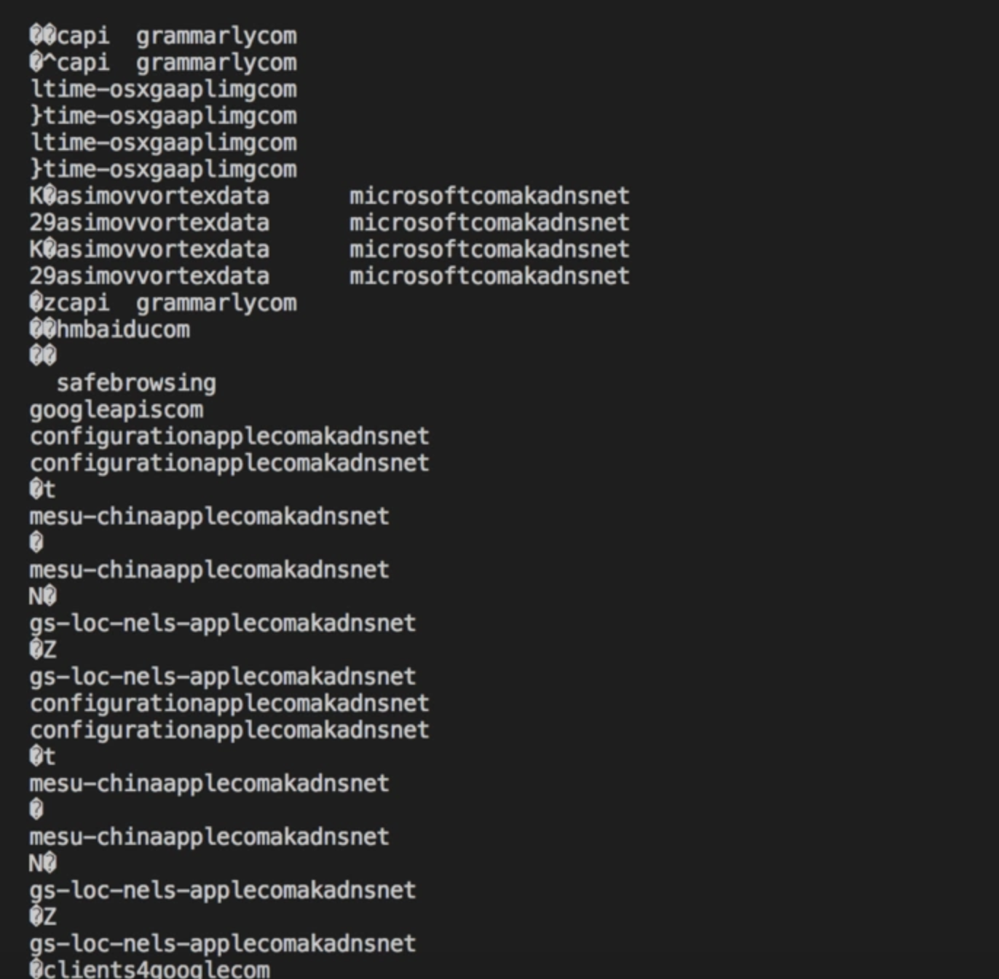
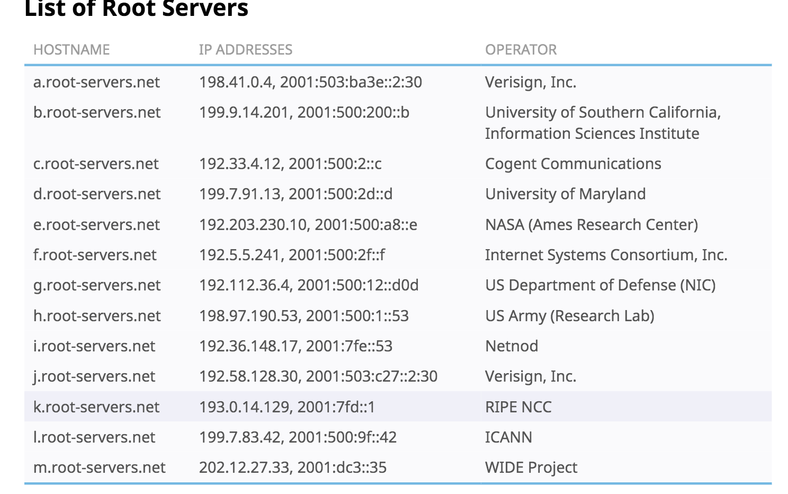
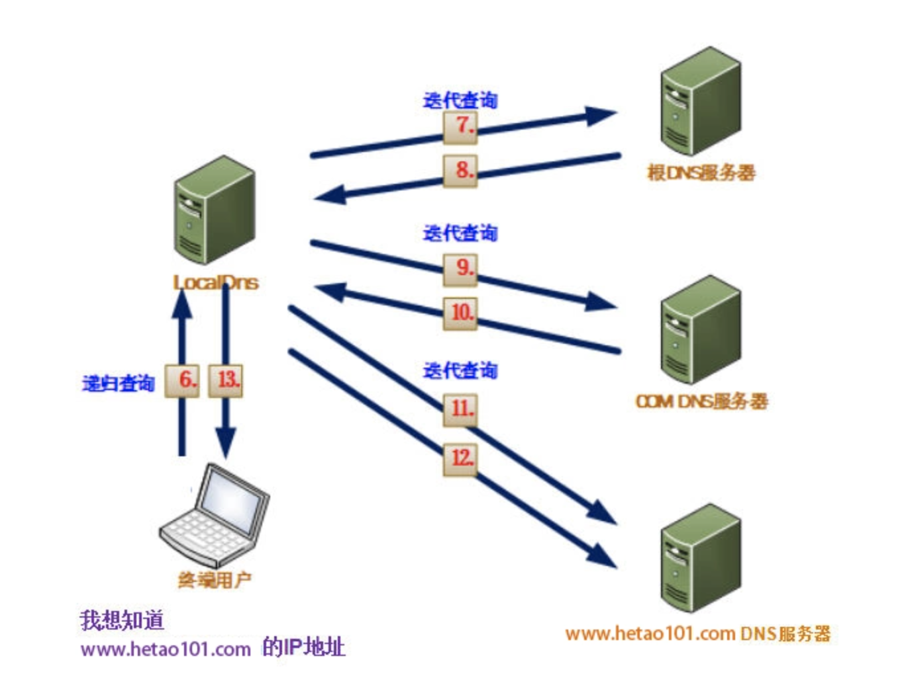

## 本地(Local Resolver)

DNS对于大多数同学来说都可能知道是干嘛的，但是深入了解工作原理可能有些模糊，首先它它分布在很多个阶段，整体分为两大块：本地DNS服务，远端DNS服务。

每台电脑本地都会配置一个DNS解析文件，在Nginx上我们可以在 `/etc/resolv.conf` 中查看，当然也可以从界面中查看。

下面是我在CLI查看我的本地DNS服务配置，即DNS客户机配置(/etc/resolv.conf)


下面是我在设置中查看DNS服务配置


大家会问，这两个一样吗？只不过一个是在文件系统查看一个是在GUI上查看，两者没区别吧？嗯，是的没区别。

实际上，修改本地的DNS解析规则，在Nginx上有三个地方，分别是

> hosts文件(/etc/hosts) --> 网卡配置文件(/etc/sysconfig/network-scripts/**)--> DNS服务器地址配置文件(/etc/resolv.conf)

我们刚才修改的只是系统的DNS服务器地址配置文件，当然在内网的路由网址上也是对应的这个文件。前两个配置方式比较粗暴，在这里就不讲了，有伤大雅。

分析一下配置文件中的字段(实际上还有很多，先说两个吧)：

1. Domain(Mac中网络-高级-搜索域) 提供一个基本的搜索域，`解析失败的域名会和这个基本的搜索域拼接`，再去做DNS解析，看我下面偷的这一句话，就明白它的作用了。**例如，如果您指定搜索域为 apple.com，在您的网页浏览器中键入“store”将会前往 store.apple.com。或者，如果使用 campus.university.edu 作为搜索域，那么您可以在“访达”的“连接服务器”对话框中键入“server1”来连接到 server1.campus.university.edu。**

2. Nameserver(Mac中网络-高级-DNS服务器)，也就是`本地的DNS服务器列表`，它的格式是IP地址，v4 v6 都可以，远端或本地地址都可以，甚至这个地址可以填写一个`内网IP`，然后我们就可以自定义处理DNS解析服务了。

`nameserver`这个字段就太好玩了，通常家庭版的地址是`192.168.1.1`，也就是大多数路由器的IP地址，然后用户可以在自己的路由器设置页面配置DNS解析服务器的地址。如下



当然，你也可以不使用路由器来转发你的DNS解析，直接填写这个`根DNS服务器`地址，也就是图上面的222.*。

作为程序员，突发奇想，我们还可以玩的更浪一些~~~，就比如：

添加一个本地域名解析服务，也就是添加一个127.0.0.1在你的DNS配置文件中，注意一定要添加在第一行，别忘了Nameserver是有序的哦。



然后在本地开一个`UDP`服务，监听`53`端口(53端口是Linux御赐的DNS服务端口)，你就会看到本地的DNS处理记录：

```javascript
let dgram = require('dgram');
let socket = dgram.createSocket('udp4');
// 服务端监听一个端口 数据到来时 可以读出信息
socket.bind(53,'localhost',function(){
    //读取消息
    socket.on('message',function(data,rinfo){
        console.log(data.toString());
    })
});
```

下面这些**乱七八糟**的，就是DNS解析记录...



我们可以修改上面的代码来`自定义解析后的信息`，我不知道这个返回状态应该怎么设定，没事闲的同学可以去查查怎么可以伪造这个信息，听起来很刺激... 
不过我觉得脚本化有些棘手，53端口受特殊保护，就连监听和查看它的占用情况都需要`提权`，上述代码linux上出`EACCES`错的可以加上sudo，win提权太麻烦不说了。

说了一大堆没用的，回正题，现在开始我们**假设本地DNS服务接受了一个软件的解析请求～～**

并且上述的 hosts文件 --> 网卡配置文件--> DNS服务器地址配置文件，前两个不做任何处理的情况下。一个DNS解析请求将会按照以下顺序处理。

1. 在DNS解析服务开始之前，系统会找到我们设定(一般电脑或路由层都会预设，我们上边也说了好几种方式设置了，可以是内网也可以是外网的根服务器地址)
的DNS服务器列表，在我这是两个，10.10.* and 10.120.*（统统为内网地址） 从第一个开始向这个DNS服务器发送域名解析请求。
 
2. 如果第一个处理失败，或者查询不到，就用第二个找。也就是 10.120.*。

3. 如果10.120.*也找不到(最后一个nameserver)，那么使用这个domain来处理了。

**本地DNS服务的任务就是接受计算机软件的DNS解析服务，去向根DNS服务器发送请求，获得最终的IP地址。**

如果本地有 DNS resolver 的话，也是可以缓存你的DNS解析的，什么是Resover？就是咱们刚才建立在53端口的服务，它就是一个Resolver。

```bash
// 验证是否存在 resolver
sduo lsof -i:53
// or 查看 /etc/resolv.conf 
```
resolver 有可能缓存上一次DNS解析结果。如果碰到恶意的resolver，看谁不顺眼就可以筛选所有某站的主域名(比如竞争对手的...嘿嘿)
返回一个不存在的ip地址，然后这个域名在那台电脑上就查询不到啦，除非技术手动撤销这个resolver，否则卸载重装这个应用， 重启电脑，
统统不好使。

所以，友情提醒：`尽量不要使用本地的DNS resolver。`，检测办法可以通过查看53端口是否被进程占用着。

## 远端DNS服务器

远端DNS服务器的作用是，接收到来自世界各地的主机(通过本地的DNS服务发出的)请求，然后分析域名返回对应的IP，看起来这是一个大而又沉重的活对吧？
其实对于 ICANN -- 世界域名管理机构，它并不需要做什么～～～，为什么呢？请继续看 😁。

### 根DNS(Root DNS)

根DNS服务商有很多，下图是目前世界范围内最大的根DNS服务商。



通常，电脑在出厂时，系统都会默认设置一个根DNS IP。

以`ICANN`为例，它只是把域名分类，并通过这个类别下发给`顶级DNS服务机构`，分类的方式通过域名后缀，.com, .cn, .net 等等，
比如 `.cn` 域名主要是`中国互联网络信息中心（CNNIC）`托管，这个机构就是`顶级DNS服务机构`，
所以实际上ROOT DNS 只需要存储这些`顶级DNS服务机构`的主机地址(IP)就可以。

接着从上面的本地DNS服务开始说，它把解析请求发送给 20.20.* 服务器，这个服务器就是根DNS，所有DNS解析请求都经过它来`转发`，
根DNS服务器免费的没有几个，国内的114.114*比较快一点，国外的Google的8.8.8.8, 8.8.4.4(国内外的搜索引擎企业都可以做
DNS服务，他们有天然优势，因为爬取内容时本身就是一个个DNS解析，它们完全可以维护一套自己的域名解析系统，当然也有超出自己的范围外的域名，比如墙内外~~~，所以nameserver最好设置
多个)，都是普遍使用的。

那么又一个问题，世界上这么多域名才这么几个服务器，而且每台电脑的DNS解析请求是非常频繁的，他们受得住吗？

### 顶级 DNS(TLD DNS)

首先，ROOT DNS 确实是接受所有的来自世界各地的请求(实际上也肯定不是一台物理机，会分发给好多台去处理请求，即单IP可对应多台机器，多台机器也可以使用一个IP)，
但它不负责处理这个解析，只负责`分类并返回顶级DNS服务器IP`。然后LocalDNS接收到这个`顶级DNS服务 IP`后，再去`迭代`查询。

`注意，以上的递归查询和迭代查询的区别，递归查询的是:我向A请求，A你必须得给我一个结果，不到黄河不死心。而迭代查询是，我向A请求，
A有可能没有这个东西，它把B返回给你，让你和B问，DNS查询属于后者`

另外，ROOT DNS 服务都做了防Ddos攻击的措施，不会轻易垮掉，这里再稍微说一点，早期DNS 服务使用UDP也是有这个原因的，第一是为了客户端快(一来一回就结束)，自己的服务器压力也会小，
但是直到现在，也在慢慢的开始普及TCP，因为假如有丢包的情况，没有重试机制(通常这种情况也不会导致客户机的访问资源失败，因为大部分主机和运营商都提供备选的ROOT DNS 服务地址)，
但是你懂的，总会有人喷。

这个阶段，如果你本地有DNS缓存服务(每个语言都有对应的库去实现DNS缓存功能)的话，它会记住某个域名与它所属的`顶级DNS的IP地址`，
下次请求直接去同样类别的`顶级DNS服务`地址，而不用经过ROOT DNS处理。

`顶级DNS服务器`接到Local DNS的请求之后，查询此域名之后发现它已经交给`专属DNS服务器`(也就是你购买域名时设置的域名解析服务器)处理

所以呢，`顶级DNS的作用就是帮助Root DNS减少很多查库和处理请求的时间，其次也做了一个分区的管理`

### 专属/自定义DNS服务器

自定义DNS属于我们域名下的专属DNS服务器，我们可以使用自己的DNS服务器配置到你的域名上(`申请DNS服务器需要到国内注册局申请办理`)。
实际上，配置二级，三级等多级的域名都是靠它来的，它更接近与`服务级`, 而上面的顶级DNS属于查找`主域`(企业级)，ROOT DNS 属于`国际区域划分级别`(国际域名分区管理，比如美国
中国，俄罗斯等等地区)。

如果是本地内网搭建，就没那么多规则，可以使用`Berkeley Internet Name Domain`。(通常，企业在内网会使用此类工具搭建一个DNS服务，把每个后端开发者的名字对应到
它的主机上，这样就能很好的和其他同事调试接口)

在阿里云买过域名的都知道，购买完毕后是可以绑定上域名解析的，它默认使用的是万网的DNS服务器(它就是阿里云提供的默认的自定义DNS服务器)，如果你有自己的DNS服务器的话，
可以在域名管理中配置。

最后来张图通一通。以我司客户端为例：

2. `LocalDNS` 接收到一个客户端发送的域名解析请求，看看本地有没有上次缓存的现成的`hetao101域下的DNS服务器`。如果没有，取出第一个nameserver(也就是根DNS服务器)，进行`迭代查询`。如果有，直接跳到第5步。

3. `根DNS`解析我们的`www.hetao101.com`地址属于 .com 区，然后把 .com 区的顶级DNS服务器的IP返回给`Local DNS`处理。

4. `Local DNS`收到`顶级DNS`的IP，然后再次发送`迭代查询`向顶级DNS服务。

5. `顶级DNS`查询数据库，找到`hetao101`这个**主**域名对应的`专属DNS服务`地址，然后把地址返回给`Local DNS`。

6. Local DNS发送请求到`专属DNS服务器`，通过查看`www`，然后返回给这个二级域名对应的IP地址。

7. Local DNS拿到IP后非常鸡冻(来回串了这么多服务器终于拿到了)，赶紧握握手亲热亲热，然后开始了建立网络通道(e.g TCP)。



## CDN服务器

网络就是数个灯泡中间的导线，电线长了，电流抵达的速度也就慢了，灯泡亮的速度就慢了。。。

所以，我们在导线的中间加上了一个`继电器式`的资源服务器。也就是CDN服务器。保证资源快速响应给局部用户。

CDN服务器通常包括一个源站和子节点(其他区域的资源服务器)，上传文件到CDN服务器首先到达源站，然后源站分发给子节点。
然后当客户端请求时候通过它们自己的DNS服务器解析请求IP(地理位置因素)，然后返回不同的子节点地址。

如果源站的资源被替换或者删除，子节点也会与它同步。

简单的打了个比方，具体使用场景及原理，可以自行Google，不多说了废话了，下面简单说下我遇到那个问题。

> 最近遇到一个小问题，在更新资源文件后，在某些用户的请求中会莫名其妙的出现`302`然后重定向地址是404，在这里分享下导致这种问题的原因。

上下文：这个请求是阿里云OSS的，客户是河北沧州移动运营商，重定向后的IP地址后面添加相比源路径多了很多层路径，位置是河北石家庄的移动网络。

我一开始的分析是，本地DNS服务或运营商缓存了DNS解析(阿里云DNS解析后的IP是可以根据客户端的区域分配就近节点的，所以应该被分到了石家庄节点)，然后当我更新这个文件时，由于ISP缓存没有到期(假定是ISP，还有可能是本地DNS Resolver)，然后更新文件后，继续请求上次的解析后的地址(地址上是有文件的hash的)，导致资源404(hash值被更新)。

仔细想一下是不对的，首先DNS解析只会返回域名区段，不会给你添加路径。第二如果是阿里云子节点在上传文件到源站的时候，就会同步到各个子节点，所以不会出现404的情况。

那么，如果这个重定向的IP地址不是阿里云的，难道是运营商自己的，它把响应文件缓存起来，然后放到自己的缓存服务器，如果请求在缓存期内就从运营商自己的缓存服务器里取？我估计这个也不可能，因为，条件是`每次在阿里云OSS上更新文件时，才会出现这个问题`，所以，有两种可能：

1. 因为资源是和阿里云源站同步的，所以，可判定这个地址并不是运营商的地址(是阿里云的)。
2. DNS劫持，劫持和缓存一样，区别是前者以攻击为目的，给你返回期望之外的IP，后者是给你目标IP。

而当我分析上面说的302返回的重定向地址时，我不太确信这是一个DNS劫持，因为这地址看起来`太正经`，如：

`http://111.**.135.171/files/317200004364C385/***.oss-cn-beijing.aliyuncs.com/***.zip`

第一段 IP，后面的的路径非常有规律，files下面的file hash，然后是源站的下载地址。

这么正经的IP不可能是被劫持吧，那么再说回去，如果302是运营商的DNS缓存导致的，302后的地址也就是这个地址，它是怎么来的呢？？

我分别测试了山东和杭州的网络，DNS解析`***.oss-cn-beijing.aliyuncs.com`这个源下载地址并没有返回动态子节点IP，实际上还是beijing区的源站IP，这说明DNS解析是没有动态返回节点的。

不是运营商也不是阿里云，究竟是什么？

愁了我一个星期，在阿里云栖社区问了此问题，也没有收到特别准确的回答，因为用户的问题已经使用其他方式修复，所以没有办法再次确定问题，目前只能认为是

1. DNS劫持

2. 运营商的DNS缓存,DNS缓存阿里云的OSS地址解析后的IP，可是并不起作用，因为阿里的OSS使用的是虚拟站点，用DNS后的ip+路径 和 地址+路径是不一样的, 。
`DNS解析后的IP是不能直接替换域名的`，DNS是为了取IP，而IP是在建立`连接层`之根基，但是连接层上还有写一层，一些服务器上的httpserver，比如Apach或者Nginx会提供一个叫做`虚拟站点`的功能，简单来说根据你请求的host(域名)来分拨出不同的文件路径，也就是说一台服务器是可以享有多个域名的。当然不仅是分拨路径，中间还可以去向其他服务请求(有点像proxy，但是根据域名来判断的proxy分拨)，想了解更多请搜索 `虚拟站点`。


不知道大家有什么可以提出的意见没有～～
