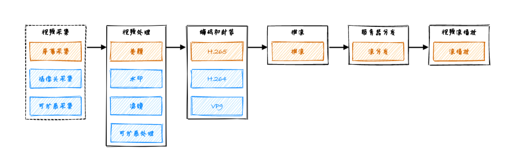
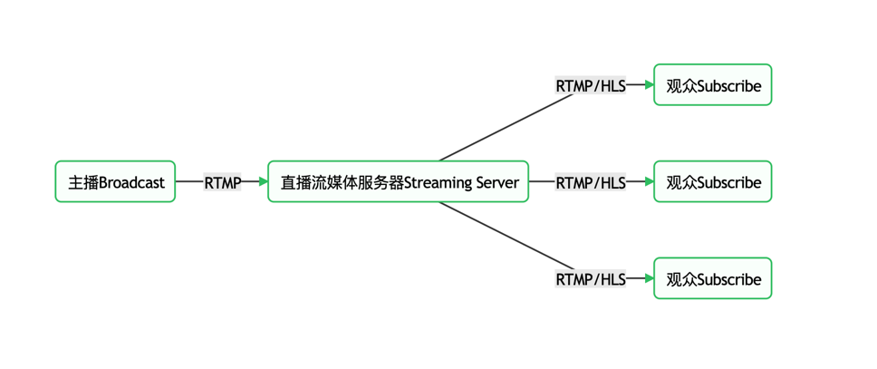

## 推拉流

  

  

### HLS

Http Live streaming, 苹果推出的一个基于HTTP协议的直播方案，原理也是切成m3u8小文件，收流端按顺序下载然后播放。

这种延迟时间取决于文件块的大小，但是大小又和整体的网络环境有关。综合情况下延迟比较高，一般在10 - 30S之间。

耗时主要在生成和上传ts文件，ts文件是音视频流内容。生成并上传了数个ts文件后，会把他们写到一个manifest文件中，一般称为m3u8文件，这里边包含一些meta信息还有生成的HTTP URL TS文件列表。

对收流端来说，如果是一对多的直播，生成时间是稳定的，把一段时间的内的视频 chunk 推到 CDN 并同步对应下载地址列表就可以，主要耗时是生成 -> 上传ts文件过程。

但对下载时间来说，客户端要等至少下载完，并且下载完两个片段才可播放。只是为了无缝衔接两个文件中的过渡。

总体来看，兼容性高，并且成本也不高。就是延迟大。适合对实时性要求不高，只直播，无信令的场景，这种情况不会感受到视频和消息的延迟差异。

### RTMP

Real Time Mssaging Protocal，用TCP协议做通道，上层封装了自己的应用层协议。传输速度并不慢，因为是实时消息传输，相比于 HLS 要快很多了，延迟基本在5S左右。

RTMP是Adobe发布的，流行于flash时代。但flash没落了之后，客户端很少有能直接使用RTMP收流的，基本都配合其他协议去接收。比如HLS，FLV。

推流端，RTMP依旧是行业的主力，还有在视频监控等领域广泛被使用。

实现和部署的话，也很简单，搭个Nginx，然后配置上RTMP的环境，一个可以接收 & 分发 RTMP流的服务器就有了。

推流端首先encode视频流成一块 Message，然后循环这个操作发送到服务端。

现在很多直播平台基本都兼容 RTMP 推流，在 OBS 中可以直接设置推流到的服务端地址。

### FLV

Flv 也是 Adobe 发明的，起初作为Flash的数据格式内容，直到目前大多数直播方案的音视频服务也都是用的FLV数据容器传输。

为什么呢，因为格式方便解析，通用型好，相比于上边提到的用 m3u8 封装的 ts文件，flv文件本身就包含了meta信息，和音视频信息。

## WebRTC

Web Real-Time Communication, WebRTC 是为了 P2P 即时通许设计的，完全兼容现代的浏览器。但在两个浏览器中直接实现 WebRTC 是不现实的，需要配合打洞，一般情况下
客户端的网络是不具备接收外部的网络请求的，只能发送。

主流的方式是推送到服务端，由服务端分发流，而分发又分几种，分发的是 WebRTC协议数据还是通过 FLV，HLS经过CDN下发呢。前者成本很高，比较适合人数较少的直播场景。

但万人直播间，直接使用WebRTC发流是不现实的。成本太高。

大多数使用第二种方法，或者自己实现一个基于C端的P2P技术减少服务器的带宽支持，协议还是使用WebRTC。这么做成本比较低，实时性能得到保证，比较复杂的是
策略设计，比如每个用户群体之间他们的流能不能共用，还有客户端的打洞发布。

## MCU

MCU 一般用在多个媒体流场景，就像直播间连麦，四五个主播一起开摄像头，麦克风，这种情况对观众来说是接收四股流，还是一股呢，当然是一股比较好。但是一股的话就需要合并音视频流，

MCU就是在服务端做的一层编解码合并音视频操作。通过增加服务器的算力，减少观众的流量消耗。